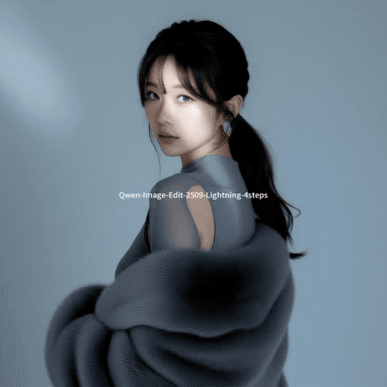
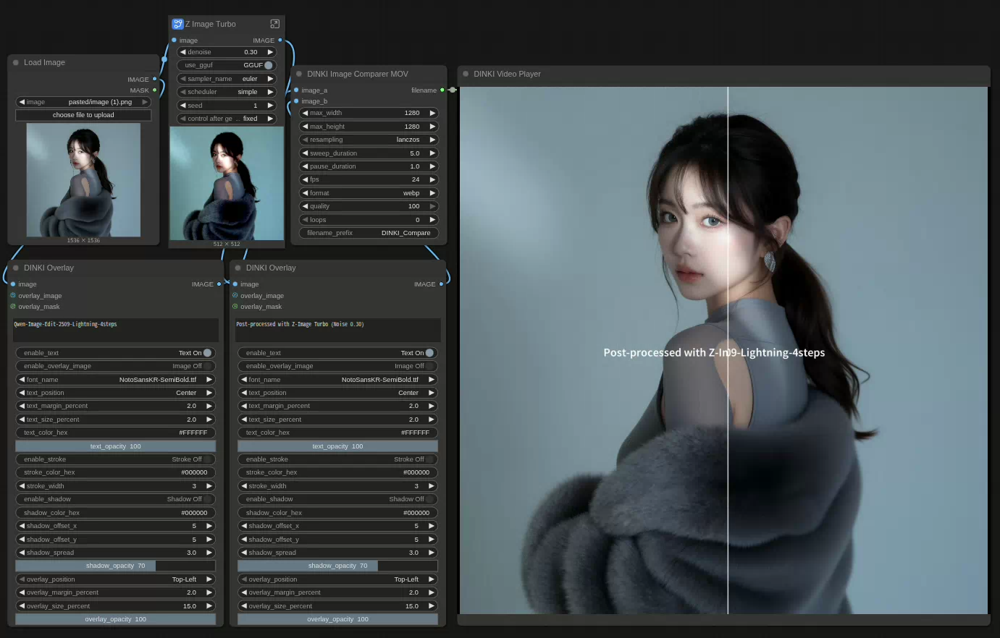
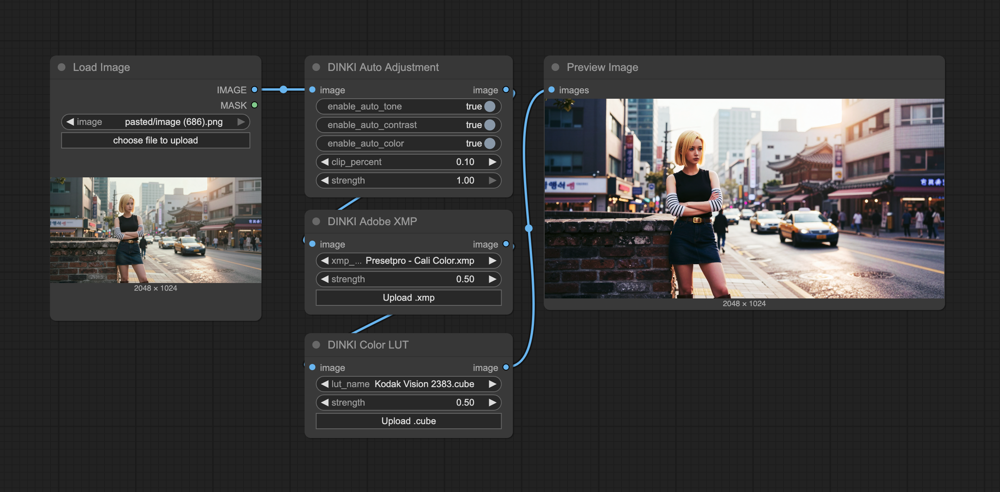
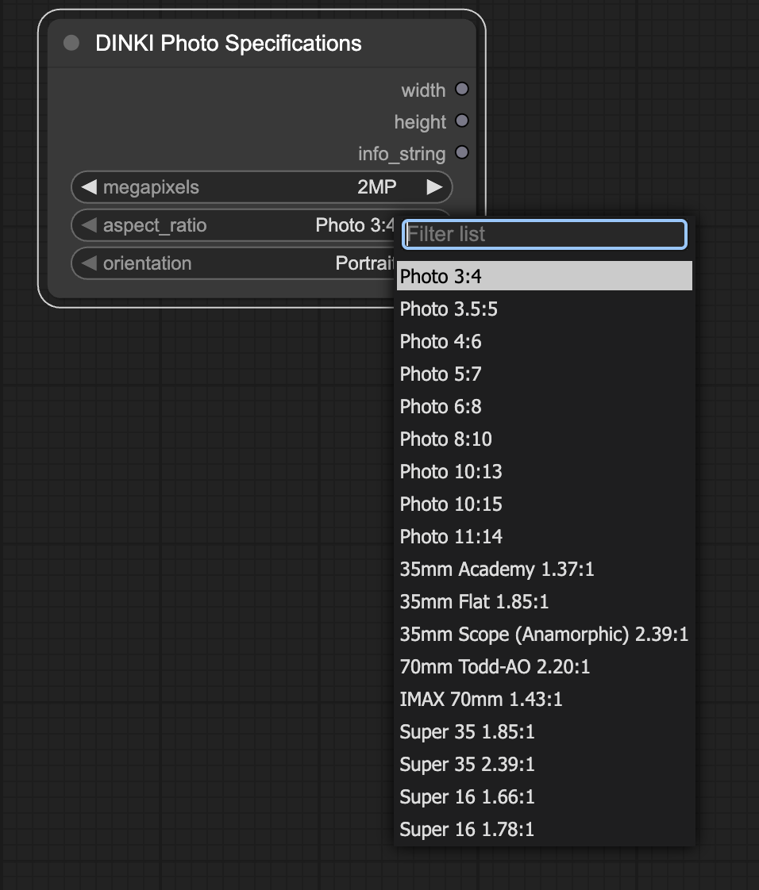
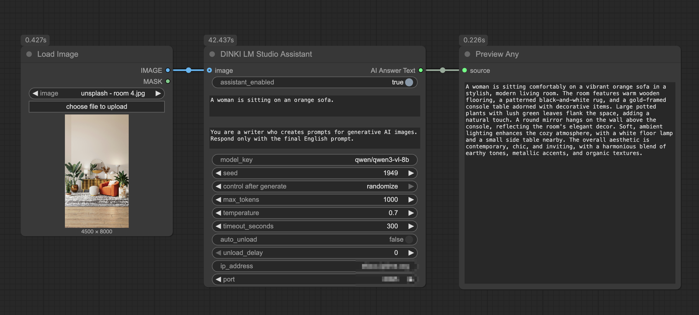
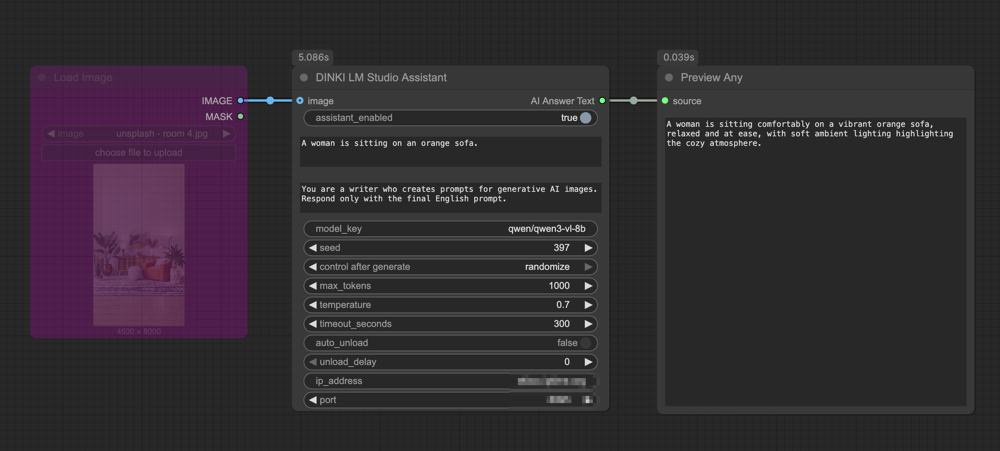
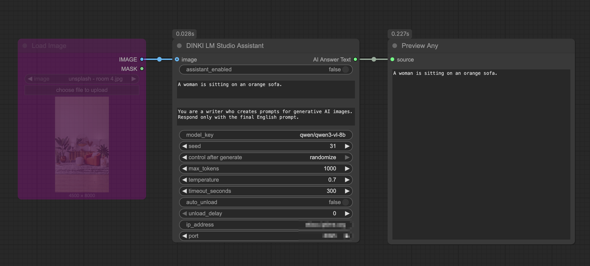
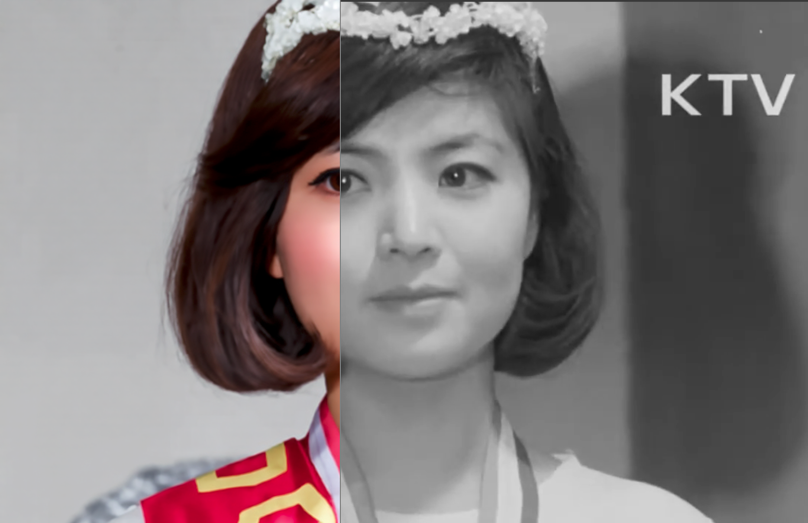
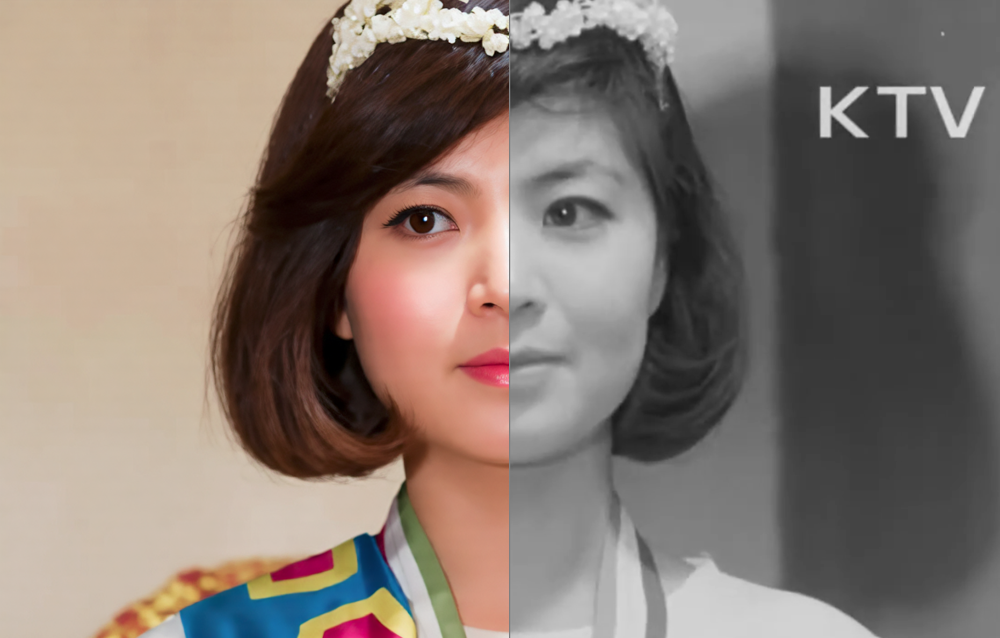
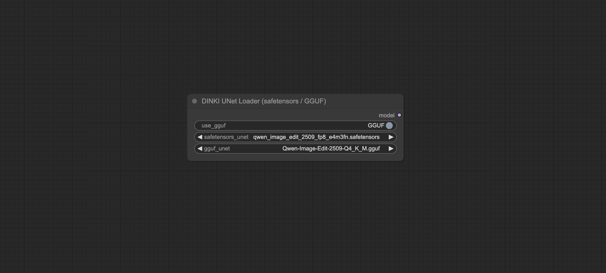

📘 Available Languages  
- [English](./README.en.md)  
- [한국어](./README.ko.md)

# Introduction

This repository stores custom ComfyUI nodes that I created to solve various needs while working with ComfyUI.  
These nodes are primarily designed for my own workflow using **Qwen-Image**, **Flux**, and **WAN**.  
Using them with other models may cause unexpected issues.

# Node Descriptions

## 🎬 DINKI Video Tools
  
  
[Download Image_Comparison_Video_with_Overlays.json](sample_workflows/Image_Comparison_Video_with_Overlays.json)

A comprehensive node suite designed to create **Before/After sliding comparison animations** and **play them directly** within your ComfyUI workflow.

#### ✨ Key Features

* **Dynamic Comparison Generator:**
    * **Sliding Animation:** Creates a professional "scanner-style" sweep animation between two images (Base vs. Target).
    * **Smart Resizing:** Automatically detects input aspect ratios. It only downscales images if they exceed your set `max_width` or `max_height`, **preventing black bars (letterboxing) or cropping**.
    * **Multi-Format Support:** Exports to high-quality **MP4** for video editing or **GIF / Animated WebP** for web sharing.
* **Integrated Video Player:**
    * **On-Graph Playback:** Instantly plays the generated result inside the node graph without opening external players.
    * **Canvas Sync:** The player overlay automatically tracks the node's position and zoom level in real-time.
    * **Format Auto-Detection:** Seamlessly handles video tags for MP4/MOV and image tags for GIF/WebP.
* **Animation Controls:**
    * **Timing Precision:** Fully customizable `sweep_duration` (movement speed) and `pause_duration` (hold time at start/end).
    * **Looping:** Set specific loop counts or infinite looping (for GIF/WebP).

#### 💡 Usage Tip: Smart Resolution
To maintain the **original quality and resolution** of your input images:
1.  Set both `max_width` and `max_height` to **0**.
2.  The node will use the exact dimensions of `image_a` as the source resolution.
3.  The images will only be resized if you explicitly set a pixel limit (e.g., 1920) to reduce file size.


#### 🎛️ Input Parameters (DINKI Image Comparer MOV)

| Parameter | Description |
| :--- | :--- |
| **image_a / image_b** | Connect the two images you want to compare (Before & After). |
| **max_width/height** | Limit the maximum output size. Set to **0** to keep original resolution. |
| **sweep_duration** | Time (in seconds) for the divider line to travel across the image. |
| **pause_duration** | Time (in seconds) the animation holds still at the start and end. |
| **fps** | Frames per second. Higher values result in smoother motion. |
| **format** | Choose output format: `mp4`, `gif`, or `webp`. |
| **quality** | Compression quality (1-100). |
| **loops** | Number of loops for GIF/WebP (0 = Infinite). |

#### 📺 Input Parameters (DINKI Video Player)

| Parameter | Description |
| :--- | :--- |
| **filename** | Connect the output `filename` string from the **Image Comparer** node here. |


---


## 🖼️ DINKI Overlay


A powerful and versatile ComfyUI node designed to add **watermarks, copyright text, subtitles, and logo overlays** to your generated images with professional precision.

#### ✨ Key Features

* **Dual Layering System:** Add **Text** and **Image** overlays simultaneously or independently using simple toggle switches.
* **Advanced Text Styling:**
    * **Custom Fonts:** Automatically detects `.ttf` and `.otf` files in the `fonts` folder for easy dropdown selection.
    * **Stroke (Outline):** Add colored outlines to your text for better visibility on complex backgrounds.
    * **Drop Shadow:** Create depth with adjustable shadow position (offset), blur (spread), and opacity.
    * **Multiline Support:** Perfect for subtitles or long copyright notices with automatic line spacing handling.
* **Precise Positioning:** Choose from **7 preset positions** (e.g., Top-Left, Bottom-Center, Center) and fine-tune with percentage-based **margins**.
* **Adaptive Sizing:** Scale text and logos relative to the source image size (%) for consistent results across different resolutions (SDXL, Flux, etc.).
* **Transparency Control:** Full support for **Alpha/Masks** (transparent PNGs) and adjustable opacity (0-100%) for both text and images.

#### 📂 How to Add Custom Fonts
1.  Go to the node's directory: `~/ComfyUI/custom_nodes/ComfyUI-DINKIssTyle/fonts/`
2.  Paste your `.ttf` or `.otf` font files into this folder.
3.  Restart ComfyUI. Your fonts will automatically appear in the **`font_name`** dropdown list.

#### 💡 Usage Tip for Transparent PNGs (Logos)
To properly overlay a logo with a transparent background:
1.  Connect the `IMAGE` output of your **Load Image** node to `overlay_image`.
2.  Connect the `MASK` output to `overlay_mask`.
3.  *(Optional)* Use the `overlay_opacity` slider to blend the logo with the background.

#### 🎛️ Input Parameters

| Parameter | Description |
| :--- | :--- |
| **font_name** | Select a font from the `fonts` folder. |
| **text_content** | Enter your text here. Supports multiple lines (enter key). |
| **text_opacity** | Adjust text transparency (0-100). |
| **enable_stroke** | Toggle text outline. Set color and width. |
| **enable_shadow** | Toggle drop shadow. Adjust offset (X/Y), spread (blur), and opacity. |
| **overlay_mask** | (Optional) Connect a mask here to support transparent PNG logos. |


---

# DINKI Color Nodes


#### DINKI Auto Adjustment Node
The **DINKI Auto Adjustment** node implements the following automatic correction features:
- **Auto Tone**
- **Auto Contrast**
- **Auto Color**
- **Auto Skin Tone**

#### DINKI Adobe XMP Node
The **DINKI Adobe XMP** node applies presets from **Adobe Lightroom** and **Adobe Camera Raw**.  
Currently supported adjustments include:

- **Exposure**
- **Contrast**
- **Saturation**
- **Vibrance**
- **Tone Curve** (Master Curve + RGB Channels)
- **HSL** (Hue / Saturation / Luminance)
- **Vignette**
- **Grain**  
XMP preset files should be placed in: **~/ComfyUI/input/adobe_xmp**


#### DINKI Color LUT Node
The **DINKI Color LUT** node applies color LUTs in **.cube** format.  
Place your LUT files in: **~/ComfyUI/input/luts**

#### DINKI AI Oversaturation Fix
Reduces excessive saturation or color distortion often produced by AI-generated images.

---

## 🎚️ DINKI Node Switch

A logic utility node that acts as a **remote control** for your workflow. It allows you to **toggle the Bypass status** of multiple target nodes simultaneously using a simple switch.

Perfect for creating "Control Panels" in complex workflows, allowing you to turn entire sections (like Upscaling, Face Detailer, or LoRA stacks) on or off without hunting for individual nodes.

#### ✨ Key Features

* **Remote Control:** Manage the state of any node in your graph from a single location.
* **Batch Toggling:** Control multiple nodes at once by entering a comma-separated list of Node IDs (e.g., `10, 15, 23`).
* **Workflow Optimization:** Easily disable heavy processing steps (like high-res fix) during initial testing, then re-enable them for the final render with one click.
* **Frontend Integration:** Directly interacts with the ComfyUI graph interface to visually mute/unmute nodes.

#### 💡 How to Use
1.  **Find Node IDs:** In ComfyUI settings, enable **"Show Node ID on Node"** (or right-click a node > Properties to see its ID).
2.  **Input IDs:** Enter the IDs of the nodes you want to control into the `node_ids` field (e.g., `5, 12, 44`).
3.  **Toggle:**
    * **On (True):** Target nodes are **Enabled** (Active).
    * **Off (False):** Target nodes are **Bypassed** (Muted).

### 🎛️ Inputs

| Parameter | Description |
| :--- | :--- |
| **node_ids** | A string of node IDs separated by commas (e.g., `1,2,3`). |
| **active** | The master switch. Toggles the bypass state of the defined nodes. |


---

## 📸 DINKI Photo Specifications


A smart utility node designed to calculate the **optimal resolution** for AI generation by selecting target **megapixels** and **real-world standard aspect ratios**.

Eliminate the guesswork of manual pixel entry. This node ensures your images are generated at the perfect size for models like SDXL, Flux, and Z-Image Turbo.

### ✨ Key Features

* **Real-World Standards:** Supports a wide range of formats, from standard **Photography** ratios (3:4, 4:6) to professional **Cinema/Film** specifications (Academy, IMAX, Super 35).
* **AI Optimization:** Automatically adjusts Width and Height values to **multiples of 8**, preventing encoding errors and ensuring compatibility with latent diffusion models.
* **Megapixel Targeting:** Select from **1MP to 4MP** based on your model's capacity (Base: 1MP = 1024x1024). It maintains consistent quality by preserving the total pixel area across different aspect ratios.
* **Instant Orientation:** Easily toggle between **Portrait** and **Landscape** modes without recalculating.

#### 💡 Workflow Tip
I found this node to work especially well with **Z-Image Turbo** workflows, ensuring fast generation at the most efficient resolutions.


#### 🎛️ Supported Formats

| Category | Aspect Ratios |
| :--- | :--- |
| **Photo** | 3:4, 3.5:5, 4:6, 5:7, 6:8, 8:10, 10:13, 10:15, 11:14 |
| **Cinema** | 35mm Academy (1.37:1), 35mm Flat (1.85:1), 35mm Scope (2.39:1) |
| **Premium** | 70mm Todd-AO (2.20:1), IMAX 70mm (1.43:1) |
| **Super** | Super 35 (1.85:1 / 2.39:1), Super 16 (1.66:1 / 1.78:1) |

#### 📤 Outputs
* **width (INT):** Calculated width (multiple of 8).
* **height (INT):** Calculated height (multiple of 8).
* **info_string (STRING):** Summary of current settings (e.g., `896x1152 (Photo 3.5:5, 1MP)`).


---


## 🤖 DINKI LM Studio Assistant

**DINKI LM Studio Assistant** is a powerful bridge node that connects ComfyUI directly to **LM Studio**. It enables the use of local Large Language Models (LLMs) and Vision Language Models (VLMs) within your workflows for tasks like image captioning, prompt enhancement, and creative writing.

### ✨ Key Features

* **Multimodal Capabilities:** Supports both **Text-to-Text** and **Image-to-Text** (Vision) generation.
* **Local & Private:** Runs entirely on your local machine via LM Studio server—no API keys or internet required.
* **Batch Support:** Automatically processes image batches, sending them individually to the LLM for analysis.
* **Memory Management:** Includes an `auto_unload` feature to free up VRAM for Stable Diffusion generation after the LLM task is finished.
* **Flexible Control:** Full access to LLM parameters like `temperature`, `max_tokens`, and `system_prompt`.

### 🚀 Modes of Operation

#### 1. Vision Mode (Image + Text)
When an **image is connected**, the node operates as a Vision Assistant.
* The image is sent to the LLM along with your `user_prompt`.
* **Use Case:** Connect a Vision model (like Qwen3-VL or Gemma3) in LM Studio to caption images, describe styles, or analyze composition.
* *Note: If `user_prompt` is left empty, the LLM will default to "Describe the images."*



#### 2. Text Mode (Text Only)
When **no image is connected**, the node functions as a pure text generator.
* It generates text based solely on the `user_prompt` and `system_prompt`.
* **Use Case:** Prompt expansion, style generation, or creative writing.



#### 3. Passthrough Mode
By setting `assistant_enabled` to **False**, the node bypasses the LLM entirely and simply outputs your raw `user_prompt`. This is useful for A/B testing without removing the node.




### 🛠️ Prerequisites & Setup

1.  **Install LM Studio:** Download and install [LM Studio](https://lmstudio.ai/).
2.  **Load a Model:**
    * For **Text-only**: Load any LLM (Llama 3, Mistral, etc.).
    * For **Vision**: Load a vision-capable model (e.g., `Qwen-VL`, `LLaVA`, `BakLLaVA`).
3.  **Start Local Server:**
    * Go to the **Local Server** tab ( double arrow icon <-> ) in LM Studio.
    * Click **Start Server**.
    * Ensure the port matches the node settings (Default: `1234`).

### 🎛️ Parameters Guide

| Parameter | Description |
| :--- | :--- |
| **assistant_enabled** | Master toggle. If `False`, passes input text directly to output without calling the LLM. |
| **ip_address** | The IP of the LM Studio server (Default: `127.0.0.1`). |
| **port** | The port of the LM Studio server (Default: `1234`). |
| **model_key** | The model identifier string (e.g., `qwen/qwen3-vl-8b`). Can often be left generic depending on LM Studio version. |
| **system_prompt** | Defines the AI's persona (e.g., "You are a prompt engineer..."). |
| **user_prompt** | Your specific instruction or query. |
| **max_tokens** | Maximum length of the generated response. |
| **temperature** | Creativity control (0.0 = Precise/Deterministic, 1.0+ = Creative/Random). |
| **auto_unload** | If `True`, sends a request to unload the model from VRAM after generation. Essential for GPUs with limited VRAM. |
| **unload_delay** | Seconds to wait before unloading the model (if `auto_unload` is True). |


## 📚 DINKI Batch Images

A smart utility node designed to **combine multiple individual images into a single image batch**.

Unlike standard batch nodes that error out when image dimensions differ, this node automatically **resizes** all incoming images to match the resolution of the first image, ensuring a seamless batching process.

#### ✨ Key Features

* **Mass Input:** Connect up to **10 different images** at once.
* **Auto-Resizing:** Automatically scales all images to match the dimensions (Width/Height) of the **first input image**. No more "Shape Mismatch" errors!
* **Mode Switching:** Easily toggle between creating a batch or just passing through the first image for testing.

#### 💡 Workflow Tip
This node works perfectly with **DINKI LM Studio Assistant**. Use it to batch multiple reference images together and send them to a Vision LLM for bulk analysis or captioning in a single pass.


### 🎛️ Parameters

| Parameter | Description |
| :--- | :--- |
| **batch_image** | **True (multiple):** Resizes and merges all connected images into one batch.<br>**False (single):** Ignores the rest and outputs only the first image found (Pass-through mode). |
| **image1 ~ 10** | Connect your images here. Inputs can be left empty; the node automatically detects active connections. |

---


### 📐 DINKI Resize and Pad Image / Remove Pad

This pair of nodes is essential for workflows involving image editing models (like **Qwen Image Edit**) that are sensitive to aspect ratio changes or resolution resizing.

**1. DINKI Resize and Pad Image** Resizes an input image to fit within a target square resolution (default **1024×1024**) while *preserving the original aspect ratio*. It automatically adds padding (letterboxing) to fill the remaining space.

**2. DINKI Remove Pad from Image** Takes the processed image and the `PAD_INFO` from the first node to crop the padding out, restoring the **exact original aspect ratio**.

#### 💡 Why use this?
This workflow prevents **pixel shifting artifacts** and distortion in models like Qwen Image Edit. It ensures that prompt-based editing requests are processed as accurately as possible by maintaining the subject's original proportions throughout the generation process.

#### Comparison
**Without Resize and Pad (Distorted/Shifted):**


**With DINKI Resize and Pad (Accurate):**


#### 🎛️ Parameters Guide

**DINKI Resize and Pad Image**
| Parameter | Description |
| :--- | :--- |
| **target_size** | The target resolution for the square canvas (e.g., 1024). The longest side of the image will fit this size. |
| **resize_and_pad** | **True:** Applies resizing and padding.<br>**False:** Bypasses the node (returns original image). |
| **upscale_method** | Algorithm used for resizing (lanczos, bicubic, area, nearest). |

**DINKI Remove Pad from Image**
| Parameter | Description |
| :--- | :--- |
| **pad_info** | Connect the `PAD_INFO` output from the *Resize and Pad* node here. Contains cropping metadata. |
| **latent_scale** | (Optional) Connect the `latent_scale` output from **DINKI Upscale Latent By**. <br>Allows correct cropping even if the image was upscaled in latent space (e.g., during High-Res Fix). |
| **remove_pad** | **True:** Crops the padding.<br>**False:** Returns the input image as-is. |

---

## 🔀 DINKI Cross Output Switch

A simple yet handy utility for A/B testing or routing logic. It swaps the two input images based on a boolean toggle.

#### 🎛️ Parameters Guide

| Parameter | Description |
| :--- | :--- |
| **image_1 / image_2** | The two input images to be swapped. |
| **invert** | **False:** Output 1 = Image 1, Output 2 = Image 2.<br>**True:** Output 1 = Image 2, Output 2 = Image 1 (Swapped). |

---

## ▦ DINKI Grid


An essential ComfyUI node for compiling up to **10 images** into a customizable grid layout. Perfect for creating comparison sheets, storyboards, or organized image galleries.

#### ✨ Key Features

* **Flexible Matrix Layout:** Define your own grid structure by setting **Columns** and **Rows** (e.g., 2x3, 4x4). Images fill the grid from Left-to-Right, Top-to-Bottom.
* **Smart Resolution Handling:**
    * **Base Resolution:** The grid cell size is automatically determined by the resolution of **Image 1**.
    * **Adaptive Resizing:** Subsequent images are automatically resized to fit the cell using methods like **Fit**, **Crop**, or **Stretch**.
* **Upscale Comparison Mode:**
    * **No Resize (Top-Left):** A specialized mode where images are placed at their original scale without resizing. Ideal for comparing **Upcaled vs. Original** images side-by-side to visualize detail enhancement.
* **Custom Styling:**
    * **Frames:** Add spacing between images with adjustable **Frame Thickness** (supports 0 for seamless grids).
    * **Background:** Customize the background color (Hex code) for frames and empty cells.
* **Output Optimization:**
    * **Size Limiter:** Toggle `limit_output` to prevent generating massive files. Automatically downscales the final grid to fit within `max_width` / `max_height` while maintaining aspect ratio.

#### 💡 Layout Logic Example
If you set the grid to **2 Columns × 3 Rows** (Total 6 cells) but connect only **5 images**:
1.  Images 1-2 fill Row 1.
2.  Images 3-4 fill Row 2.
3.  Image 5 fills the first slot of Row 3.
4.  The last empty slot will be filled with your specified **Background Color**.


#### 🎛️ Input Parameters

| Parameter | Description |
| :--- | :--- |
| **image_1 ~ 10** | Connect up to 10 images. Unconnected slots are ignored. |
| **cols / rows** | Set the number of columns and rows for the grid. |
| **frame_thickness** | Width of the border around each image (in pixels). Set to 0 for no gap. |
| **bg_color_hex** | Hex color code for the background/frame (e.g., `#000000`, `#FFFFFF`). |
| **resize_method** | Choose how images fit the cell: `Fit`, `Crop`, `Stretch`, or `No Resize`. |
| **limit_output** | Enable to restrict the maximum pixel dimensions of the final image. |
| **max_output_w/h** | The maximum allowed width/height if limit is enabled. |

---

## 👁️ DINKI Image Preview

A robust preview node that handles empty signals gracefully. If no image is provided (e.g., a skipped step due to a switch), it automatically generates a **custom placeholder image** containing text instead of crashing or showing an error.


#### 🎛️ Parameters Guide

| Parameter | Description |
| :--- | :--- |
| **images** | (Optional) Connect your image here. If disconnected/None, the placeholder is shown. |
| **placeholder_text** | Text to display on the placeholder (e.g., "Bypassed"). |
| **width / height** | Dimensions of the placeholder image. |
| **bg_gray / fg_gray** | Background and Text brightness (0-255 grayscale). |
| **font_path** | Path to a custom .ttf file. If empty, it attempts to find a system font. |

---

## 📝 DINKI CSV Prompt Selector (Live)

Quickly insert frequently used prompts or LoRA triggers by selecting them from a dropdown menu.

* **Setup:** Create a file named **`prompt_list.csv`** inside your ComfyUI **`input`** folder.
* **CSV Format:** `Title, Prompt Text`
    ```csv
    LoRA - ToonWorld, ToonWorld
    LoRA - Photo to Anime, transform into anime
    ```
* **Live Update:** The node refreshes the list from the CSV file automatically on every run.

#### 🎛️ Parameters Guide

| Parameter | Description |
| :--- | :--- |
| **title** | Select the key/title defined in your CSV file. The node outputs the corresponding prompt text. |

---


## 🎲 DINKI Random Prompt


A versatile prompt generator that builds complex prompts using a custom CSV file. It allows you to organize tags by category and offers granular control over each section—choose a specific tag, randomize it, or skip it entirely.

* **Setup:** Ensure your CSV file is located at `~/ComfyUI/custom_nodes/ComfyUI-DINKIssTyle/csv/DINKI_Random_Prompt.csv`.
* **CSV Format:** `Category, Tag/Prompt`
    ```csv
    Art Style, Cyberpunk
    , Steampunk
    Camera, 35mm lens
    , Wide angle
    ```
* **Dynamic Controls:** The node automatically creates dropdown menus for every unique category found in the CSV file.

#### 🎛️ Parameters Guide

| Parameter | Description |
| :--- | :--- |
| **text_input** | (Optional) Fixed text to appear at the beginning of the prompt (e.g., "masterpiece, best quality"). |
| **seed** | Controls the random selection. Keep the seed fixed to reproduce the same "random" combination. |
| **[Category Name]** | Dynamic dropdowns generated from your CSV categories. <br>• **Specific Value**: Manually select a specific tag.<br>• **-- Random --**: Randomly picks one tag from this category.<br>• **-- None --**: Skips this category entirely. |


---


## ⬆️ DINKI Upscale Latent By

An enhanced latent upscaling node designed for flexibility and pipeline integration. It features a "Snap to Multiple" function to prevent odd-resolution errors.

#### 🎛️ Parameters Guide

| Parameter | Description |
| :--- | :--- |
| **scale_by** | The multiplier for upscaling (e.g., 1.5x). |
| **snap_to_multiple** | Ensures the resulting resolution is a multiple of this number (default 8). Prevents "odd dimension" errors in VAEs. |
| **enabled** | **True:** Performs upscaling.<br>**False:** Bypasses the node (returns original latent). |
| **upscale_method** | Algorithm for latent interpolation (nearest-exact, bicubic, etc.). |

> **Output Note:** The `latent_scale` output provides the *actual* scaling factor used (after snapping), which can be sent to **DINKI Remove Pad from Image**.

---

## 🧠 DINKI UNet Loader (safetensors / GGUF)

A streamlined loader that combines **safetensors** and **GGUF** model loading into a single node. This removes the need to place separate loader nodes and rewire connections when switching between standard and quantized models.



#### 🎛️ Parameters Guide

| Parameter | Description |
| :--- | :--- |
| **use_gguf** | **True (GGUF):** Loads the model selected in `gguf_unet`.<br>**False (safetensors):** Loads the model selected in `safetensors_unet`. |
| **safetensors_unet** | Select a standard model from `models/diffusion_models`. |
| **gguf_unet** | Select a quantized model from `models/unet_gguf`. |

---


# 📦 DINKI Base64 Image Embedding Suite
  
[Download DINKI_Base64_to_Image.json](sample_workflows/DINKI_Base64_to_Image.json)

A set of nodes designed to make your ComfyUI workflows **fully self-contained and portable**. By converting images into Base64 strings, you can embed essential reference images, masks, or logos directly inside the workflow `.json` file. 

**You can embed explanatory images or sample results directly within the Workflow.**

---

## 🖼️ DINKI Image To Base64

Prepares your image for embedding by converting it into a text-based format. Use this to generate the data needed for the **Base64 String Input** node.

#### 🎛️ Parameters Guide

| Parameter | Description |
| :--- | :--- |
| **image** | The source image you want to embed (e.g., a specific ControlNet reference or style image). |

> **Workflow Tip:** Connect an image, run the queue, and copy the resulting string. You can then paste it into the **DINKI Base64 String Input** node to permanently store it in your workflow.

---

## 💾 DINKI Base64 String Input

The core storage node. It allows you to paste the Base64 code, effectively **saving the image data inside the node itself**. When you save and share your workflow `.json`, the image travels with it.

#### 🎛️ Parameters Guide

| Parameter | Description |
| :--- | :--- |
| **base64_string** | Paste your Base64 code here. This text field acts as the permanent container for your embedded image. |

> **Key Benefit:** Eliminates external file dependencies. Users downloading your workflow will have the correct image loaded instantly, without needing to download separate assets.

---

## 👁️ DINKI Base64 Image Viewer

Unpacks and restores the embedded image data for use in generation. It visualizes the stored Base64 string and converts it back into a standard IMAGE format.

#### 🎛️ Parameters Guide

| Parameter | Description |
| :--- | :--- |
| **base64_string** | Connects to the **DINKI Base64 String Input** node to retrieve the stored image data. |

> **Smart Decoding:** Automatically handles standard Base64 headers.
>
> **Output:** Returns a standard `IMAGE` tensor, allowing the embedded image to be used immediately in KSampler, ControlNet, or Image-to-Image processes.


