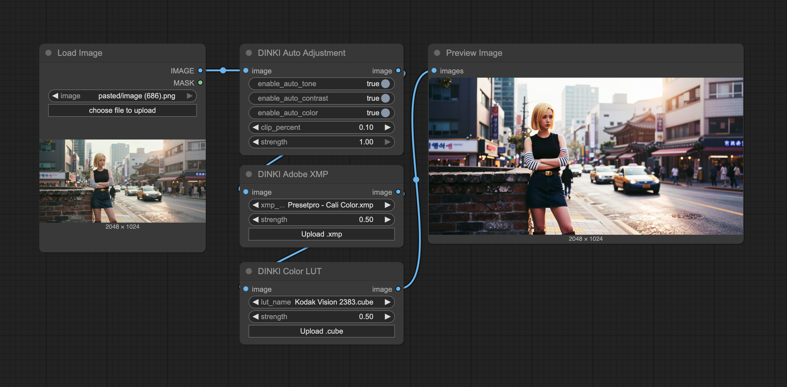

[Home](../README.md) · [All nodes](Node_Catalog.md)

# Color nodes

All seven nodes accept an `IMAGE` and return an `IMAGE` in `DINKIssTyle/Color`.

## DKST Color (Auto Adjust)

Enable any combination of `enable_auto_tone`, `enable_auto_contrast`, `enable_auto_color` (on by default), and `enable_skin_tone`. `clip_percent` controls the clipping used by the automatic adjustments; `strength` blends the correction with the original image.

## DKST Color (Adobe XMP)

Select an `xmp_file` from the ComfyUI `input/adobe_xmp` folder and set `strength` from 0 to 1. The node handles exposure, contrast, saturation, vibrance, master/RGB tone curves, HSL, vignette, and grain settings supported by its parser. `-- None --` passes the image through. This folder is created when the extension loads.

## DKST Color (XMP Preview)

Uses the same `xmp_file` and `strength` controls as Adobe XMP. After the node has run with an image, its frontend preview can show changes to the preset or strength without queueing the whole workflow again. The node still returns the processed image when executed.

## DKST Color (LUT)

Select a 3D `.cube` file in ComfyUI `input/luts` with `lut_name`; `strength` blends the LUT result with the input. The folder is created when the extension loads. `-- None --` passes the image through.

## DKST Color (LUT Preview)

Uses the same `lut_name` and `strength` controls as LUT. Run the node once to supply an image for the interactive frontend preview, then adjust the LUT or strength to inspect the effect. It returns the processed image when executed.

## DKST Color (Oversaturation Fix)

`fix_enabled` bypasses the correction when off. Choose `desaturate_highlights`, `global_desat`, `chroma_limit`, or `auto` with `mode`. `saturation_reduction` and `highlight_threshold` control highlight desaturation; `max_chroma` limits chroma; `preserve_skin_tones` protects skin hues in highlight mode. `strength` blends the correction with the source.

## DKST Color (Deband)

Reduces visible banding with a guided filter and optional grain. `enabled` bypasses the node when off. `threshold` controls the smoothing tolerance, `radius` the filter neighborhood, `iterations` the number of passes, and `grain` the amount of noise added afterward. Larger radii and iteration counts take more processing time.
