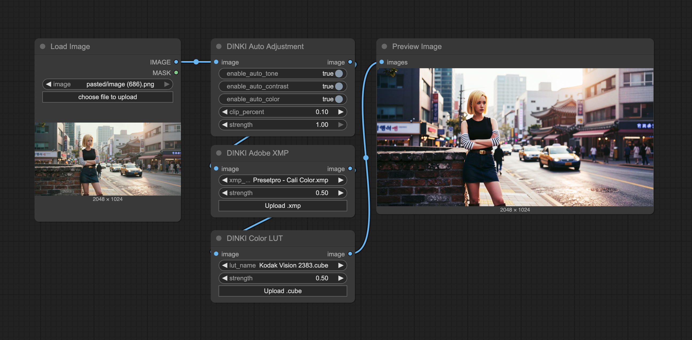

[Home](../README.md) · [All nodes](Node_Catalog.md)

# Color nodes

All eight nodes accept an `IMAGE` and return an `IMAGE` in `DINKIssTyle/Color`.

## DKST Color (Photo Studio)

A separate all-in-one rendered-photo editor. Connect `image`; optionally connect `depth_image` for Lens Blur. `active` bypasses every adjustment. Light, Color, Effects, Detail, Optics, and Lens Blur appear as separate, non-interactive section headers, followed by their controls. The headers are not settings and are not saved in presets or workflows. `depth_near_is_white` reverses the depth convention when needed. `grain_seed` makes grain repeatable. Neutral defaults pass the input through exactly; RGB and RGBA are supported. Alpha is unchanged by color adjustments and warped with RGB by Distortion.

Numeric photo controls use sliders that show their values; `grain_seed` remains a number input. The rendered-image Temperature control uses a relative -100 to +100 scale rather than RAW Kelvin; Exposure uses -5 to +5 stops. Most signed tone, color, and effect controls use -100 to +100, and strength-only controls use 0 to 100. Both Effects Vignette and Optics Vignette accept -100 to +100: negative darkens corners, positive brightens them. These ranges and control directions follow Camera Raw where applicable, but the pixel-processing formulas are independent approximations. The Bokeh control is a simulated f-number from f/0.1 to f/30; Camera Raw itself offers Bokeh shape choices rather than an f-number control. Aperture Blades is an integer slider from 5 to 18, defaulting to 9.

Adobe references: [color and tonal adjustments](https://helpx.adobe.com/camera-raw/desktop/using/make-color-tonal-adjustments-camera.html), [manual lens correction](https://helpx.adobe.com/sg/camera-raw/desktop/using/correct-lens-distortions-camera-raw.html), and [Lens Blur](https://helpx.adobe.com/in/camera-raw/desktop/edit-and-enhance-images/sharpening-and-noise/lens-blur.html).

Lens Blur requires a depth image when Apply is on. Depth batch size must be 1 or match the image batch; its aspect ratio must match, but its resolution may differ. Focus is a normalized depth value from 0 to 1, and a smaller Bokeh f-number increases simulated defocus. Defocused layers use a polygon aperture kernel, so Aperture Blades changes the shape of blurred highlights in the image. At f-numbers above 8, isolated bright points also receive subtle simulated diffraction rays: odd blade counts produce twice as many rays, and even counts produce the same number of rays as blades. These effects are approximations, not a physical lens simulation. White Balance works on rendered pixels; Custom Temperature and Tint are relative corrections, not Kelvin or camera raw metadata. Effects Vignette adds a creative edge adjustment, while Optics Vignette corrects or adds edge falloff.

Depth Blur Radius and Depth Sigma smooth the incoming depth map with a Gaussian kernel before Lens Blur. Their defaults are 5 and 2.0, matching the user's Blur Image settings; Radius 0 disables smoothing. The depth preview shows the smoothed map, so clicking it selects the depth value used by the renderer. These settings have no effect when Lens Blur Apply is off.

The Lens Blur renderer aligns lower-resolution depth to image edges, protects the focused depth at object boundaries, and composites depth layers in linear light. It increases depth sampling for larger blur radii and retains isolated point lights as aperture-shaped bokeh; Bokeh Boost affects those lights instead of brightening whole regions. This improves silhouettes and highlight shape at the cost of more processing time than the earlier renderer. Depth maps with missing or incorrectly placed objects still need correction upstream.

Focused content is composited at its actual depth, so defocused foreground objects can overlap a focused background without the background cutting through them. The renderer uses only visible image color at depth boundaries; guessed hidden-background color caused ghost outlines in real images. Wider focus-edge protection is reserved for depth maps that had to be enlarged; full-size maps retain a narrower focus range. A wrong silhouette in the depth map can still appear in the blur and should be corrected in the depth map.

After running the node with `depth_image` connected, a grayscale depth preview appears directly below Lens Blur Apply, even if Apply is off. Each new execution updates the preview and Auto's light suggestion, including the first run after the input image changes; cached output is restored when the workflow loads. Click or drag on the preview to place a focus point and set the numeric Focus control from that location's depth. `depth_near_is_white` is respected when calculating Focus. The preview uses the first depth map in a batch and is limited to 320 pixels on its longest side; the same Focus value applies to the whole batch. Manually changing Focus clears the point marker. Run the workflow again to render the changed focus.

Preset selects a saved set of widget values. Save overwrites the selected personal preset; Save As creates a new one. The protected Default restores neutral values, and Custom keeps the current widget values. Presets are stored per ComfyUI user. Workflows store the actual widget values, so they remain reproducible without the preset file.

Workflows save Photo Studio controls by name as well as in ComfyUI's positional widget list. On load, the named values take precedence, preventing a new widget or visual separator from shifting values to a different control. Older positional workflows and presets receive the new depth-smoothing defaults.

After the node has processed an image once, Auto immediately applies the last calculated values to all six Light controls (Exposure, Contrast, Highlights, Shadows, Whites, Blacks) and sets Color White Balance to Auto. Auto does not queue a run. Run the workflow again to render with the updated settings; if the input image changes, run the node once to refresh the calculation. Other controls keep their current values. Reset restores every Light, Color, Effects, Detail, Optics, and Lens Blur control to its Default value; Active remains as set.

## DKST Color (Auto Adjust)

Enable any combination of `enable_auto_tone`, `enable_auto_contrast`, `enable_auto_color` (on by default), and `enable_skin_tone`. Auto tone adjusts median luminance toward a balanced midtone; auto contrast stretches luminance using the low and high percentiles selected by `clip_percent`. Auto color estimates neutral balance from midtone, low-saturation pixels and reduces correction when there are too few of them. Skin tone correction is limited to likely skin-colored areas. `strength` blends the correction with the original image. RGB and RGBA images are supported; alpha is preserved.

## DKST Color (Adobe XMP)

Select an `.xmp` file from the ComfyUI `input/adobe_xmp` folder and set `strength` from 0 to 1. The node approximates exposure, contrast, saturation, vibrance, master/RGB tone curves, HSL, post-crop vignette, and grain settings. Exposure assumes an sRGB image and is applied in linear-light RGB. `grain_seed` makes grain repeatable. Unsupported Camera Raw settings are reported in the server log; malformed presets produce an error instead of silently leaving the image unchanged. RGB and RGBA images are supported; alpha is preserved. `-- None --` passes the image through. This folder is created when the extension loads.

This node applies selected XMP settings to an already rendered image. Camera profiles, raw white balance, local edits, and other unsupported settings cannot be reconstructed by this node, so results will not exactly match Adobe Camera Raw or Lightroom. For example, its vibrance and vignette formulas remain approximations.

## DKST Color (XMP Preview)

Uses the same XMP controls. After the node has run with an image, its frontend preview can show changes to the preset, strength, or grain seed without queueing the whole workflow again. Each execution has its own preview image; the preview cache retains the eight most recent executions and limits the longest preview side to 1024 pixels. The node still returns the full-resolution processed image when executed.

## DKST Color (LUT)

Select a 3D `.cube` file in ComfyUI `input/luts` with `lut_name`; `strength` blends the LUT result with the input. The folder is created when the extension loads. `-- None --` passes the image through.

## DKST Color (LUT Preview)

Uses the same `lut_name` and `strength` controls as LUT. Run the node once to supply an image for the interactive frontend preview, then adjust the LUT or strength to inspect the effect. It returns the processed image when executed.

## DKST Color (Oversaturation Fix)

`fix_enabled` bypasses the correction when off. Choose `desaturate_highlights`, `global_desat`, `chroma_limit`, or `auto` with `mode`. `saturation_reduction` and `highlight_threshold` control highlight desaturation; `max_chroma` limits chroma; `preserve_skin_tones` protects skin hues in highlight mode. `strength` blends the correction with the source.

## DKST Color (Deband)

Reduces visible banding with a guided filter and optional grain. `enabled` bypasses the node when off. `threshold` controls the smoothing tolerance, `radius` the filter neighborhood, `iterations` the number of passes, and `grain` the amount of noise added afterward. Larger radii and iteration counts take more processing time.
