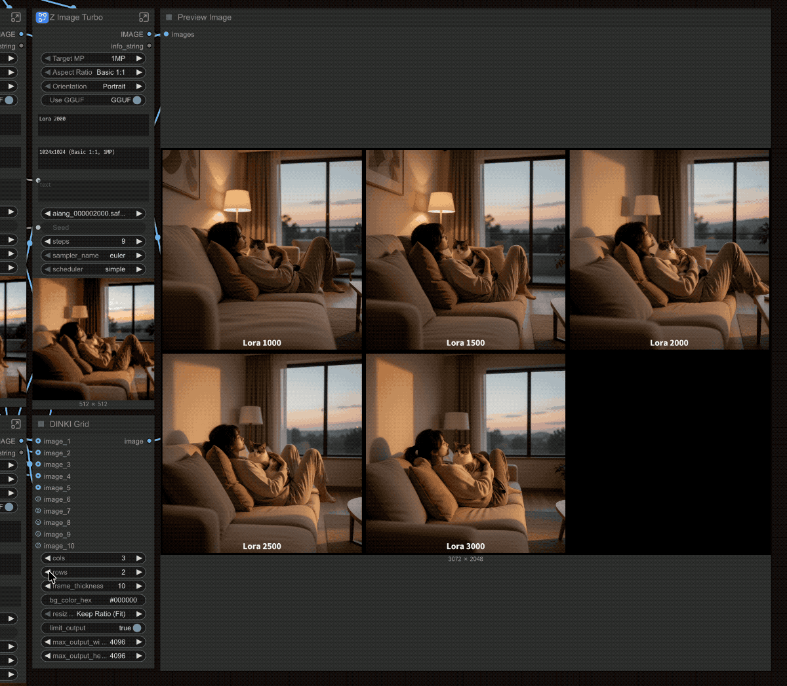
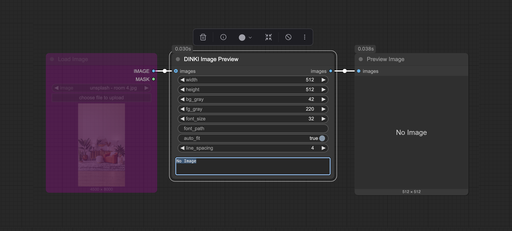
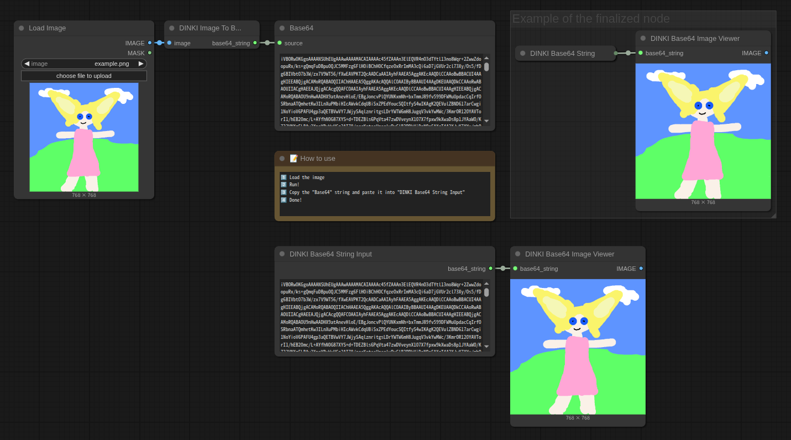

[Home](./README.md)
- [Comprision Video Tools](DINKI_Video_Tools.md)
- [Image](DINKI_Image.md)
- [Color Nodes](DINKI_Color_Nodes.md)
- [LM Studio Assistant and Batch Images](DINKI_LM_Studio_Assistant.md)
- [Prompts and Strings](DINKI_Prompt_and_String.md)
- [Node Utilities](DINKI_Node_Utils.md)
- [Internal Processing](DINKI_PS.md)

## 🖼️ DINKI Overlay

A powerful and versatile ComfyUI node designed to add **watermarks, copyright text, subtitles, and logo overlays** to your generated images with professional precision.

#### ✨ Key Features

* **Dual Layering System:** Add **Text** and **Image** overlays simultaneously or independently using simple toggle switches.
* **Advanced Text Styling:**
    * **Custom Fonts:** Automatically detects `.ttf` and `.otf` files in the `fonts` folder for easy dropdown selection.
    * **Stroke (Outline):** Add colored outlines to your text for better visibility on complex backgrounds.
    * **Drop Shadow:** Create depth with adjustable shadow position (offset), blur (spread), and opacity.
    * **Multiline Support:** Perfect for subtitles or long copyright notices with automatic line spacing handling.
* **Precise Positioning:** Choose from **7 preset positions** (e.g., Top-Left, Bottom-Center, Center) and fine-tune with percentage-based **margins**.
* **Adaptive Sizing:** Scale text and logos relative to the source image size (%) for consistent results across different resolutions (SDXL, Flux, etc.).
* **Transparency Control:** Full support for **Alpha/Masks** (transparent PNGs) and adjustable opacity (0-100%) for both text and images.

#### 📂 How to Add Custom Fonts
1.  Go to the node's directory: `~/ComfyUI/custom_nodes/ComfyUI-DINKIssTyle/fonts/`
2.  Paste your `.ttf` or `.otf` font files into this folder.
3.  Restart ComfyUI. Your fonts will automatically appear in the **`font_name`** dropdown list.

#### 💡 Usage Tip for Transparent PNGs (Logos)
To properly overlay a logo with a transparent background:
1.  Connect the `IMAGE` output of your **Load Image** node to `overlay_image`.
2.  Connect the `MASK` output to `overlay_mask`.
3.  *(Optional)* Use the `overlay_opacity` slider to blend the logo with the background.

#### 🎛️ Input Parameters

| Parameter | Description |
| :--- | :--- |
| **font_name** | Select a font from the `fonts` folder. |
| **text_content** | Enter your text here. Supports multiple lines (enter key). |
| **text_opacity** | Adjust text transparency (0-100). |
| **enable_stroke** | Toggle text outline. Set color and width. |
| **enable_shadow** | Toggle drop shadow. Adjust offset (X/Y), spread (blur), and opacity. |
| **overlay_mask** | (Optional) Connect a mask here to support transparent PNG logos. |

---

## 📸 DINKI Photo Specifications

A smart utility node designed to calculate the **optimal resolution** for AI generation by selecting target **megapixels** and **real-world standard aspect ratios**.

Eliminate the guesswork of manual pixel entry. This node ensures your images are generated at the perfect size for models like SDXL, Flux, and Z-Image Turbo.

### ✨ Key Features

* **Real-World Standards:** Supports a wide range of formats, from standard **Photography** ratios (3:4, 4:6) to professional **Cinema/Film** specifications (Academy, IMAX, Super 35).
* **AI Optimization:** Automatically adjusts Width and Height values to **multiples of 8**, preventing encoding errors and ensuring compatibility with latent diffusion models.
* **Megapixel Targeting:** Select from **1MP to 4MP** based on your model's capacity (Base: 1MP = 1024x1024). It maintains consistent quality by preserving the total pixel area across different aspect ratios.
* **Instant Orientation:** Easily toggle between **Portrait** and **Landscape** modes without recalculating.

#### 💡 Workflow Tip
I found this node to work especially well with **Z-Image Turbo** workflows, ensuring fast generation at the most efficient resolutions.

#### 🎛️ Supported Formats

| Category | Aspect Ratios |
| :--- | :--- |
| **Photo** | 3:4, 3.5:5, 4:6, 5:7, 6:8, 8:10, 10:13, 10:15, 11:14 |
| **Cinema** | 35mm Academy (1.37:1), 35mm Flat (1.85:1), 35mm Scope (2.39:1) |
| **Premium** | 70mm Todd-AO (2.20:1), IMAX 70mm (1.43:1) |
| **Super** | Super 35 (1.85:1 / 2.39:1), Super 16 (1.66:1 / 1.78:1) |

#### 📤 Outputs
* **width (INT):** Calculated width (multiple of 8).
* **height (INT):** Calculated height (multiple of 8).
* **info_string (STRING):** Summary of current settings (e.g., `896x1152 (Photo 3.5:5, 1MP)`).

---

## 📚 DINKI Batch Images

A smart utility node designed to **combine multiple individual images into a single image batch**.

Unlike standard batch nodes that error out when image dimensions differ, this node automatically **resizes** all incoming images to match the resolution of the first image, ensuring a seamless batching process.

#### ✨ Key Features

* **Mass Input:** Connect up to **10 different images** at once.
* **Auto-Resizing:** Automatically scales all images to match the dimensions (Width/Height) of the **first input image**. No more "Shape Mismatch" errors!
* **Mode Switching:** Easily toggle between creating a batch or just passing through the first image for testing.

#### 💡 Workflow Tip
This node works perfectly with **DINKI LM Studio Assistant**. Use it to batch multiple reference images together and send them to a Vision LLM for bulk analysis or captioning in a single pass.

### 🎛️ Parameters

| Parameter | Description |
| :--- | :--- |
| **batch_image** | **True (multiple):** Resizes and merges all connected images into one batch. **False (single):** Ignores the rest and outputs only the first image found (Pass-through mode). |
| **image1 ~ 10** | Connect your images here. Inputs can be left empty; the node automatically detects active connections. |

---

## ▦ DINKI Grid

An essential ComfyUI node for compiling up to **10 images** into a customizable grid layout. Perfect for creating comparison sheets, storyboards, or organized image galleries.

#### ✨ Key Features

* **Flexible Matrix Layout:** Define your own grid structure by setting **Columns** and **Rows** (e.g., 2x3, 4x4). Images fill the grid from Left-to-Right, Top-to-Bottom.
* **Smart Resolution Handling:**
    * **Base Resolution:** The grid cell size is automatically determined by the resolution of **Image 1**.
    * **Adaptive Resizing:** Subsequent images are automatically resized to fit the cell using methods like **Fit**, **Crop**, or **Stretch**.
* **Upscale Comparison Mode:**
    * **No Resize (Top-Left):** A specialized mode where images are placed at their original scale without resizing. Ideal for comparing **Upcaled vs. Original** images side-by-side to visualize detail enhancement.
* **Custom Styling:**
    * **Frames:** Add spacing between images with adjustable **Frame Thickness** (supports 0 for seamless grids).
    * **Background:** Customize the background color (Hex code) for frames and empty cells.
* **Output Optimization:**
    * **Size Limiter:** Toggle `limit_output` to prevent generating massive files. Automatically downscales the final grid to fit within `max_width` / `max_height` while maintaining aspect ratio.

#### 💡 Layout Logic Example
If you set the grid to **2 Columns × 3 Rows** (Total 6 cells) but connect only **5 images**:
1.  Images 1-2 fill Row 1.
2.  Images 3-4 fill Row 2.
3.  Image 5 fills the first slot of Row 3.
4.  The last empty slot will be filled with your specified **Background Color**.

#### 🎛️ Input Parameters

| Parameter | Description |
| :--- | :--- |
| **image_1 ~ 10** | Connect up to 10 images. Unconnected slots are ignored. |
| **cols / rows** | Set the number of columns and rows for the grid. |
| **frame_thickness** | Width of the border around each image (in pixels). Set to 0 for no gap. |
| **bg_color_hex** | Hex color code for the background/frame (e.g., `#000000`, `#FFFFFF`). |
| **resize_method** | Choose how images fit the cell: `Fit`, `Crop`, `Stretch`, or `No Resize`. |
| **limit_output** | Enable to restrict the maximum pixel dimensions of the final image. |
| **max_output_w/h** | The maximum allowed width/height if limit is enabled. |

---

## 👁️ DINKI Image Preview

A robust preview node that handles empty signals gracefully. If no image is provided (e.g., a skipped step due to a switch), it automatically generates a **custom placeholder image** containing text instead of crashing or showing an error.

#### 🎛️ Parameters Guide

| Parameter | Description |
| :--- | :--- |
| **images** | (Optional) Connect your image here. If disconnected/None, the placeholder is shown. |
| **placeholder_text** | Text to display on the placeholder (e.g., "Bypassed"). |
| **width / height** | Dimensions of the placeholder image. |
| **bg_gray / fg_gray** | Background and Text brightness (0-255 grayscale). |
| **font_path** | Path to a custom .ttf file. If empty, it attempts to find a system font. |

---

# 📦 DINKI Base64 Image Embedding Suite
  
[Download DINKI_Base64_to_Image.json](./sample_workflows/DINKI_Base64_to_Image.json)

A set of nodes designed to make your ComfyUI workflows **fully self-contained and portable**. By converting images into Base64 strings, you can embed essential reference images, masks, or logos directly inside the workflow `.json` file. 

**You can embed explanatory images or sample results directly within the Workflow.**

---

## 🖼️ DINKI Image To Base64

Prepares your image for embedding by converting it into a text-based format. Use this to generate the data needed for the **Base64 String Input** node.

#### 🎛️ Parameters Guide

| Parameter | Description |
| :--- | :--- |
| **image** | The source image you want to embed (e.g., a specific ControlNet reference or style image). |

> **Workflow Tip:** Connect an image, run the queue, and copy the resulting string. You can then paste it into the **DINKI Base64 String Input** node to permanently store it in your workflow.

---

## 💾 DINKI Base64 String Input

The core storage node. It allows you to paste the Base64 code, effectively **saving the image data inside the node itself**. When you save and share your workflow `.json`, the image travels with it.

#### 🎛️ Parameters Guide

| Parameter | Description |
| :--- | :--- |
| **base64_string** | Paste your Base64 code here. This text field acts as the permanent container for your embedded image. |

> **Key Benefit:** Eliminates external file dependencies. Users downloading your workflow will have the correct image loaded instantly, without needing to download separate assets.

---

## 👁️ DINKI Base64 Image Viewer

Unpacks and restores the embedded image data for use in generation. It visualizes the stored Base64 string and converts it back into a standard IMAGE format.

#### 🎛️ Parameters Guide

| Parameter | Description |
| :--- | :--- |
| **base64_string** | Connects to the **DINKI Base64 String Input** node to retrieve the stored image data. |

> **Smart Decoding:** Automatically handles standard Base64 headers.
>
> **Output:** Returns a standard `IMAGE` tensor, allowing the embedded image to be used immediately in KSampler, ControlNet, or Image-to-Image processes.

