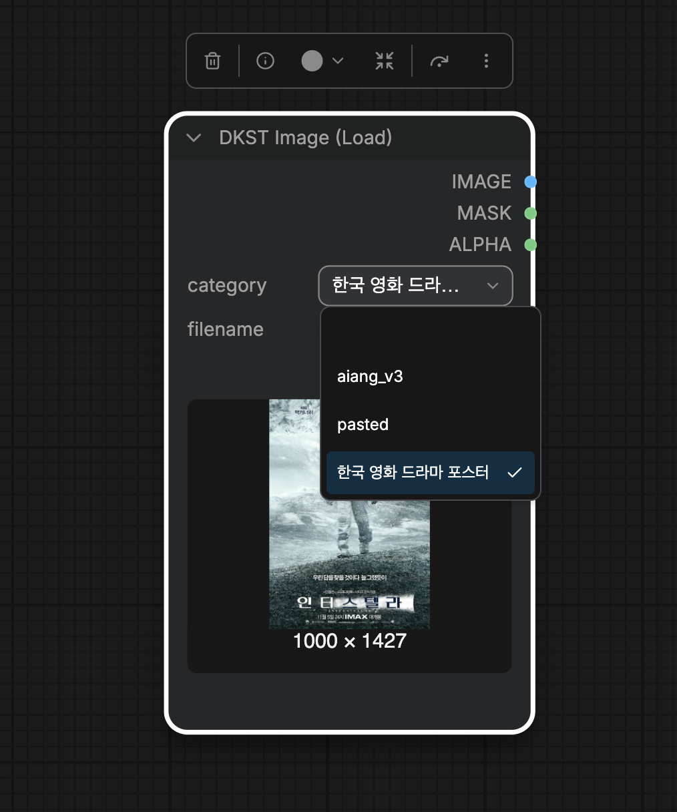
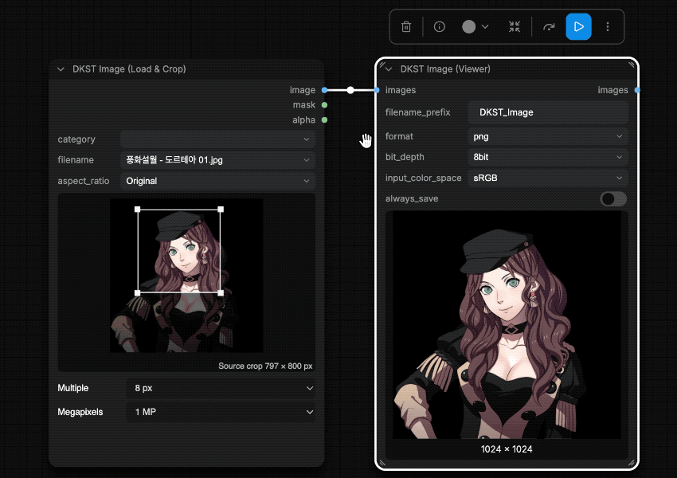
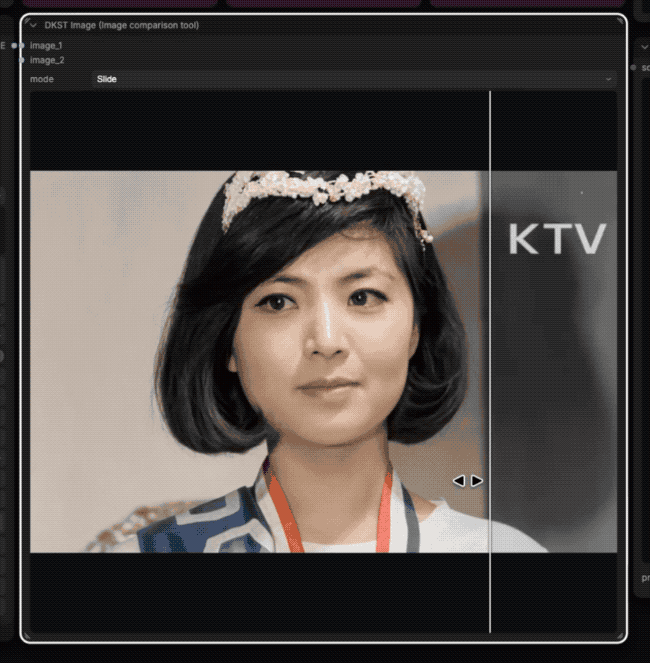
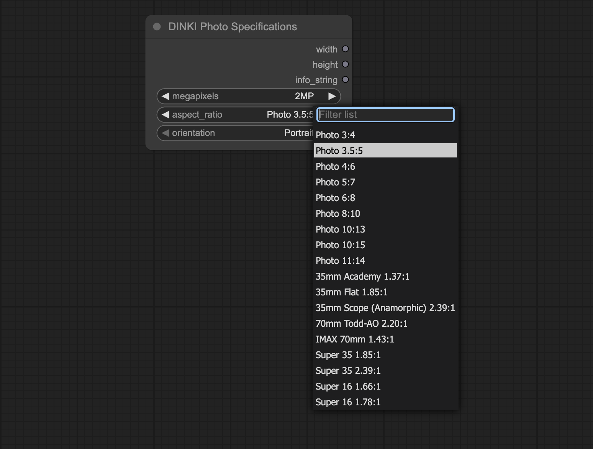
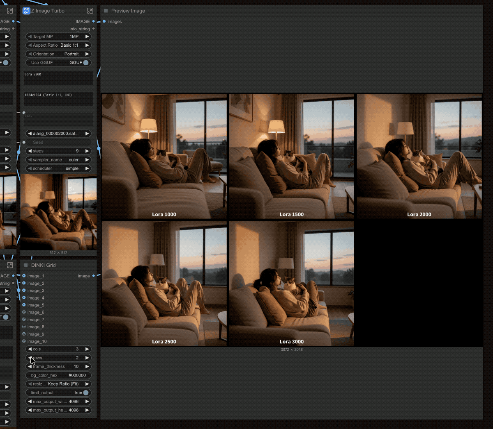
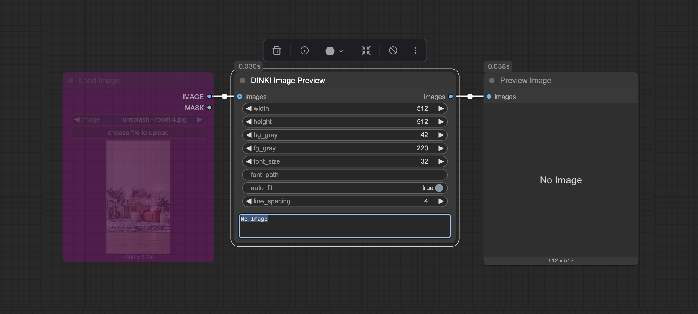
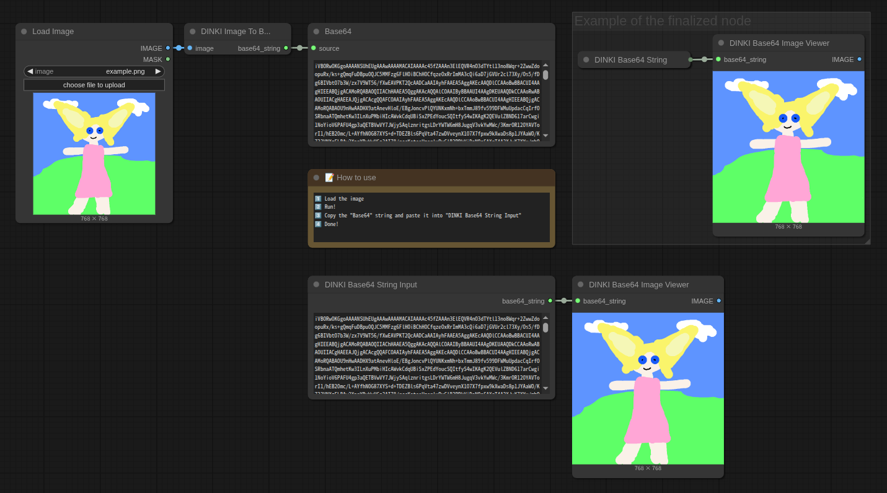

[Home](../README.md) · [All nodes](Node_Catalog.md)
- [Comparison Video Tools](DINKI_Video_Tools.md)
- [Image](DINKI_Image.md)
- [Color Nodes](DINKI_Color_Nodes.md)
- [LM Studio Assistant](DINKI_LM_Studio_Assistant.md)
- [Prompts and Strings](DINKI_Prompt_and_String.md)
- [Node Utilities](DINKI_Node_Utils.md)
- [Internal Processing](DINKI_PS.md)

## 📥 DKST Image (Load)

  

Select an image from the ComfyUI input folder, upload a file, or paste an image into the selected node. Pasted images are kept in ComfyUI's temporary directory; their preview and selection are restored when switching workflow tabs during the same server session. Temporary pasted files are cleared when ComfyUI restarts, so save images you want to keep in the input folder.

`category` selects an input subfolder and `filename` selects its image; `source_type` also permits a temporary pasted image. `IMAGE` is RGBA when any loaded frame contains transparency and RGB otherwise. `MASK` remains inverse alpha, and `ALPHA` remains alpha. Animated files produce an image batch from same-size frames. The node shows the image resolution.

---

## ✂️ DKST Image (Load & Crop)

  

Select a `category` and `filename` as in **DKST Image (Load)**. The source image appears in the crop canvas as soon as it loads; a workflow run is not required to position the crop box. Choose `Original`, a preset `aspect_ratio`, or `Custom` with two ratio numbers. Drag inside the box to move it or drag a corner to resize it while preserving the selected ratio.

The `image`, `mask`, and `alpha` outputs contain the same cropped region, resized to the dimensions selected by `resolution_multiple` (4, 8, 16, or 32) and `megapixels` (0.25, 0.56, 1, 1.68, 2, 3, or 4MP). The crop canvas shows both the source crop size and the calculated output size before running the workflow. Here, 1MP targets 1024 × 1024 pixels for a square crop (about 1.05 million pixels), with each dimension rounded to the selected multiple. Transparent images remain RGBA. Resizing uses antialiased, premultiplied-alpha interpolation for RGBA images, and `mask` remains the inverse of alpha.

Upload, paste, drag and drop, and the mask editor remain available through the node menu. The crop preview refreshes when another file is selected and on each queued run.

---

## 🌓 DKST Image (Image comparison tool)

  

Connect `image_1` and `image_2`, then run the workflow. The node compares the first image in each input batch. It uses the dimensions of the image with more pixels as the comparison canvas; ties use `image_1`. Each image is resized proportionally to fit within that canvas and centered. Unused space is filled with black, so neither image is stretched or cropped. The node preview also preserves the full image when its display area has a different aspect ratio.

* **Slide:** Move the pointer horizontally over the preview. Image 2 appears to the left of the divider and image 1 to the right.
* **Difference:** Show Photoshop-style Difference blending, calculated per RGB channel as `abs(image_1 - image_2)`. Black means identical pixels. The preview changes immediately when the mode changes after the images have been processed.

The comparison is an output node and saves three temporary PNG previews (two aligned images and their difference). Transparent input images are composited over black for comparison. Saved workflows can restore the preview while those temporary files still exist.

The node has no `IMAGE` output; use its preview to inspect the two inputs.

Right-click the comparison preview for `Mode: Slide`, `Mode: Difference`, `Open Image 1`, `Save Image 1`, `Open Image 2`, and `Save Image 2`. The image actions use the aligned temporary previews produced by the last run. Mode changes also update the node's `mode` widget.

---

## ✂️ DKST Image (Crop)

Connect an `IMAGE` and run the node once to show the input in its crop preview. Choose `Original`, a preset aspect ratio, or `Custom` with two numbers such as `4 : 5`. Changing the ratio starts with the largest centered crop that fits the source.

The node refreshes its input preview on each queued run, including when the source image changes. It can run as a preview endpoint even when its `IMAGE` output is not connected downstream.

Drag inside the rectangle to move it. Drag a corner to resize it while keeping the selected aspect ratio. The rectangle stays inside the input image. Its normalized coordinates are saved with the workflow. Run the workflow again after editing to output the crop.

The node crops pixels without resizing. The same crop is applied to every image in an input batch; the preview shows the first image. RGB and RGBA inputs are supported. A preview from a prior run can be restored when reopening the workflow, while the saved crop coordinates remain the source of truth.

---

## 🖼️ DKST Image (Overlay)

  

A powerful and versatile ComfyUI node designed to add **watermarks, copyright text, subtitles, and logo overlays** to your generated images with professional precision.

#### ✨ Key Features

* **Dual Layering System:** Add **Text** and **Image** overlays simultaneously or independently using simple toggle switches.
* **Advanced Text Styling:**
    * **Custom Fonts:** Automatically detects `.ttf` and `.otf` files in the `fonts` folder for easy dropdown selection.
    * **Stroke (Outline):** Add colored outlines to your text for better visibility on complex backgrounds.
    * **Drop Shadow:** Create depth with adjustable shadow position (offset), blur (spread), and opacity.
* **Multiline Support:** Wrap text with `text_wrap_percent`, align it with `text_align`, and adjust spacing with `line_spacing_multiplier`.
* **Precise Positioning:** Choose from **7 preset positions** (e.g., Top-Left, Bottom-Center, Center) and fine-tune with percentage-based **margins**.
* **Adaptive Sizing:** Scale text and logos relative to the source image size (%) for consistent results across different resolutions (SDXL, Flux, etc.).
* **Transparency Control:** RGBA base images retain their alpha channel. Transparent PNG overlays support **Alpha/Masks**, with adjustable opacity (0-100%) for both text and images.

#### 📂 How to Add Custom Fonts
1.  Open the `fonts` folder beside `dinki_overlay.py` in the installed node folder.
2.  Paste your `.ttf` or `.otf` font files into this folder.
3.  Restart ComfyUI. Your fonts will automatically appear in the **`font_name`** dropdown list.

#### 💡 Usage Tip for Transparent PNGs (Logos)
To properly overlay a logo with a transparent background:
1.  Connect the RGBA `IMAGE` output of **DKST Image (Load)** to `overlay_image`; its transparency is used automatically.
2.  If another loader returns only RGB with a separate `MASK`, connect that mask to `overlay_mask`. This input follows ComfyUI's mask convention: 1 means transparent and 0 means opaque. A matching mask from an older **DKST Image (Load)** workflow is detected and is not applied twice.
3.  *(Optional)* Use the `overlay_opacity` slider to blend the logo with the background.

#### 🎛️ Input Parameters

| Parameter | Description |
| :--- | :--- |
| **font_name** | Select a font from the `fonts` folder. |
| **text_content** | Enter your text here. Supports multiple lines (enter key). |
| **text_align / text_wrap_percent / line_spacing_multiplier** | Set text alignment, optional wrapping width, and line spacing. A wrap percentage of 0 disables wrapping. |
| **text_opacity** | Adjust text transparency (0-100). |
| **enable_stroke** | Toggle text outline. Set color and width. |
| **enable_shadow** | Toggle drop shadow. Adjust offset (X/Y), spread (blur), and opacity. |
| **overlay_mask** | (Optional) Add transparency when `overlay_image` lacks alpha, or apply an additional mask. |

---

## 📸 DKST Image (Photo Specs)

  

A utility node that calculates a target resolution from an input image or a selected aspect ratio and megapixel budget.

Use the resulting width and height as generation settings. The selected `resolution_multiple` rounds each dimension to a multiple supported by the workflow you are using; no single resolution is optimal for every model.

### ✨ Key Features

* **Image or Custom:** Choose a mode from the `resolution` dropdown; `Custom` is selected by default. `Image` reads the connected image's width, height, aspect ratio, and direction. Its calculation uses `resolution_multiple` and `megapixels` while bypassing the visible `aspect_ratio` and `orientation` settings. `Custom` uses those settings. An image is required only in `Image` mode.
* **Resolution Multiple:** Round both dimensions to a multiple of **4, 8, 16, or 32**. The default of 8 preserves the previous node behavior. This setting is a rounding unit, not a magnification factor or image batch size.
* **Megapixel Targeting:** Select **0.25, 0.56, 1, 1.68, 2, 3, or 4MP** as an approximate pixel-area budget (base: 1MP = 1024x1024 pixels). For a square image with multiple 8, these include 512×512, 768×768, 1024×1024, 1328×1328, and 2048×2048. The 2MP and 3MP choices offer intermediate sizes. Rounding can make the final area differ slightly from the target.
* **Custom Formats:** Choose photography and cinema ratios, then toggle **Portrait** or **Landscape**. These two controls are ignored in `Image` mode, which preserves the input image's ratio and direction.

#### 💡 Workflow Tip
For a workflow that previously used this node, keep `Custom` and `resolution_multiple: 8` to retain the same size calculation.

The [Diffusers Qwen Image Edit implementation](https://github.com/huggingface/diffusers/blob/main/src/diffusers/pipelines/qwenimage/pipeline_qwenimage_edit.py) rounds calculated dimensions to 32; select `resolution_multiple: 32` to match that calculation. Check the size requirements of the specific model and workflow before choosing a smaller multiple.

#### 🎛️ Supported Formats

| Category | Aspect Ratios |
| :--- | :--- |
| **Photo** | 3:4, 3.5:5, 4:6, 5:7, 6:8, 8:10, 10:13, 10:15, 11:14 |
| **Basic** | 1:1, 1:2, 1.5:2, 9:16, 10:16 |
| **Cinema** | 35mm Academy (1.37:1), 35mm Flat (1.85:1), 35mm Scope (2.39:1) |
| **Premium** | 70mm Todd-AO (2.20:1), IMAX 70mm (1.43:1) |
| **Super** | Super 35 (1.85:1 / 2.39:1), Super 16 (1.66:1 / 1.78:1) |

#### 📤 Outputs
* **width (INT):** Calculated width, rounded to the selected `resolution_multiple`.
* **height (INT):** Calculated height, rounded to the selected `resolution_multiple`.
* **info_string (STRING):** Summary of current settings (e.g., `896x1152 (Photo 3.5:5, 1MP)`).

`Image` mode reports both the source dimensions and calculated dimensions in `info_string`; it does not resize or output the input image.

---

## 📚 DKST Image (Batch)

A smart utility node designed to **combine multiple individual images into a single image batch**.

Unlike standard batch nodes that error out when image dimensions differ, this node automatically **resizes** all incoming images to match the resolution of the first image, ensuring a seamless batching process.

#### ✨ Key Features

* **Mass Input:** Connect up to **10 different images** at once.
* **Auto-Resizing:** Automatically scales all images to match the dimensions (Width/Height) of the **first input image**. No more "Shape Mismatch" errors!
* **Transparency:** RGBA inputs retain alpha. When RGB and RGBA inputs are combined, RGB images are treated as opaque.
* **Mode Switching:** Easily toggle between creating a batch or just passing through the first image for testing.

#### 💡 Workflow Tip
Connect the output to **DKST LLM (LM Studio)** to attach multiple reference images to a single vision request.

### 🎛️ Parameters

| Parameter | Description |
| :--- | :--- |
| **batch_image** | **True (multiple):** Resizes and merges all connected images into one batch. **False (single):** Ignores the rest and outputs only the first image found (Pass-through mode). |
| **image1 ~ 10** | Connect your images here. Inputs can be left empty; the node automatically detects active connections. |

---

## ▦ DKST Image (Grid)

  

An essential ComfyUI node for compiling up to **10 images** into a customizable grid layout. Perfect for creating comparison sheets, storyboards, or organized image galleries.

#### ✨ Key Features

* **Flexible Matrix Layout:** Define your own grid structure by setting **Columns** and **Rows** (e.g., 2x3, 4x4). Images fill the grid from Left-to-Right, Top-to-Bottom.
* **Smart Resolution Handling:**
    * **Base Resolution:** Choose an input slot from **1–10** with `reference_image` to determine the grid cell size (including frames). Defaults to **1**. If that slot is unconnected, the first connected image is used. Image placement order is unchanged.
    * **Adaptive Resizing:** Subsequent images are automatically resized to fit the cell using methods like **Fit**, **Crop**, or **Stretch**.
* **Upscale Comparison Mode:**
    * **No Resize (Top-Left):** A specialized mode where images are placed at their original scale without resizing. Ideal for comparing **Upcaled vs. Original** images side-by-side to visualize detail enhancement.
* **Custom Styling:**
    * **Frames:** Add spacing between images with adjustable **Frame Thickness** (supports 0 for seamless grids).
    * **Background:** Customize the background color (Hex code) for frames and empty cells.
* **Output Optimization:**
    * **Size Limiter:** Toggle `limit_output` to prevent generating massive files. Automatically downscales the final grid to fit within `max_width` / `max_height` while maintaining aspect ratio.
* **Transparency:** If any connected image is RGBA, the grid output is RGBA and retains each image's alpha. Frames and empty cells use the selected background color at full opacity.

#### 💡 Layout Logic Example
If you set the grid to **2 Columns × 3 Rows** (Total 6 cells) but connect only **5 images**:
1.  Images 1-2 fill Row 1.
2.  Images 3-4 fill Row 2.
3.  Image 5 fills the first slot of Row 3.
4.  The last empty slot will be filled with your specified **Background Color**.

#### 🎛️ Input Parameters

| Parameter | Description |
| :--- | :--- |
| **image_1 ~ 10** | Connect up to 10 images. Unconnected slots are ignored; the first frame of each connected batch is used. |
| **cols / rows** | Set the number of columns and rows for the grid. |
| **reference_image** | Input slot number (1–10) used for cell dimensions. An empty slot falls back to the first connected image. |
| **frame_thickness** | Width of the border around each image (in pixels). Set to 0 for no gap. |
| **bg_color_hex** | Hex color code for the background/frame (e.g., `#000000`, `#FFFFFF`). |
| **resize_method** | Choose `Keep Ratio (Fit)`, `Keep Ratio (Crop)`, `Stretch`, or `No Resize (Top-Left)`. |
| **limit_output** | Enable to restrict the maximum pixel dimensions of the final image. |
| **max_output_width / max_output_height** | The maximum allowed width/height if the limit is enabled. |

---

## 👁️ DKST Util (Image Signal)

A robust preview node that handles empty signals gracefully. If no image is provided (e.g., a skipped step due to a switch), it automatically generates a **custom placeholder image** containing text instead of crashing or showing an error.

  

#### 🎛️ Parameters Guide

| Parameter | Description |
| :--- | :--- |
| **images** | (Optional) Connect your image here. If disconnected/None, the placeholder is shown. |
| **placeholder_text** | Text to display on the placeholder (e.g., "Bypassed"). |
| **width / height** | Dimensions of the placeholder image. |
| **bg_gray / fg_gray** | Background and Text brightness (0-255 grayscale). |
| **font_path** | Path to a custom .ttf file. If empty, it attempts to find a system font. |

---

# 📦 DINKI Base64 Image Embedding Suite

  

[Download DINKI_Base64_to_Image.json](../sample_workflows/DINKI_Base64_to_Image.json)

A set of nodes designed to make your ComfyUI workflows **fully self-contained and portable**. By converting images into Base64 strings, you can embed essential reference images, masks, or logos directly inside the workflow `.json` file. 

**You can embed explanatory images or sample results directly within the workflow.**

---

## 🖼️ DKST Util (Image to Base64)

Prepares your image for embedding by converting it into a text-based format. Use this to generate the data needed for the **Base64 String Input** node.

#### 🎛️ Parameters Guide

| Parameter | Description |
| :--- | :--- |
| **image** | The source image you want to embed (e.g., a specific ControlNet reference or style image). |

> **Workflow Tip:** Connect an image, run the queue, and copy the resulting string. You can then paste it into the **DKST Util (Base64 Input)** node to permanently store it in your workflow.

---

## 💾 DKST Util (Base64 Input)

The core storage node. It allows you to paste the Base64 code, effectively **saving the image data inside the node itself**. When you save and share your workflow `.json`, the image travels with it.

#### 🎛️ Parameters Guide

| Parameter | Description |
| :--- | :--- |
| **base64_string** | Paste your Base64 code here. This text field acts as the permanent container for your embedded image. |

> **Key Benefit:** Eliminates external file dependencies. Users downloading your workflow will have the correct image loaded instantly, without needing to download separate assets.

---

## 👁️ DKST Util (Base64 Viewer)

Unpacks and restores the embedded image data for use in generation. It visualizes the stored Base64 string and converts it back into a standard IMAGE format.

#### 🎛️ Parameters Guide

| Parameter | Description |
| :--- | :--- |
| **base64_string** | Connects to the **DKST Util (Base64 Input)** node to retrieve the stored image data. |

> **Smart Decoding:** Automatically handles standard Base64 headers.
>
> **Output:** Returns a standard `IMAGE` tensor, allowing the embedded image to be used immediately in KSampler, ControlNet, or Image-to-Image processes.

---

## DKST Image (Resize)

Connect an optional `image` and set `width`, `height`, `interpolation`, `keep_proportion`, and `condition`. With `keep_proportion` on, the image fits within the requested width and height; off stretches to those dimensions. `condition` can be `always`, `downscale_if_bigger`, `upscale_if_smaller`, `if_bigger_area`, or `if_smaller_area`. The node returns the image and its actual `width` and `height`; when the condition is false it returns the original. Without an input it returns a 1×1 black placeholder.

## DKST Image (Viewer)

Displays each input image and passes the original `images` batch through. `filename_prefix` controls names. `format` supports `png`, `exr`, `avif`, and `webp`; PNG supports `8bit` and `16bit`, EXR requires `16bit`, and AVIF/WebP require `8bit`. EXR saves linear values converted from the `sRGB` input setting and uses a temporary PNG for the on-node preview. `always_save` writes to ComfyUI's output folder; otherwise files go to the temporary folder. AVIF availability depends on the installed Pillow build.

## DKST Util (Image Selector)

Accepts up to eight optional inputs (`image_1`–`image_8`) and returns the connected input with the highest slot number. With no connected image, it returns a 1×1 black placeholder.
