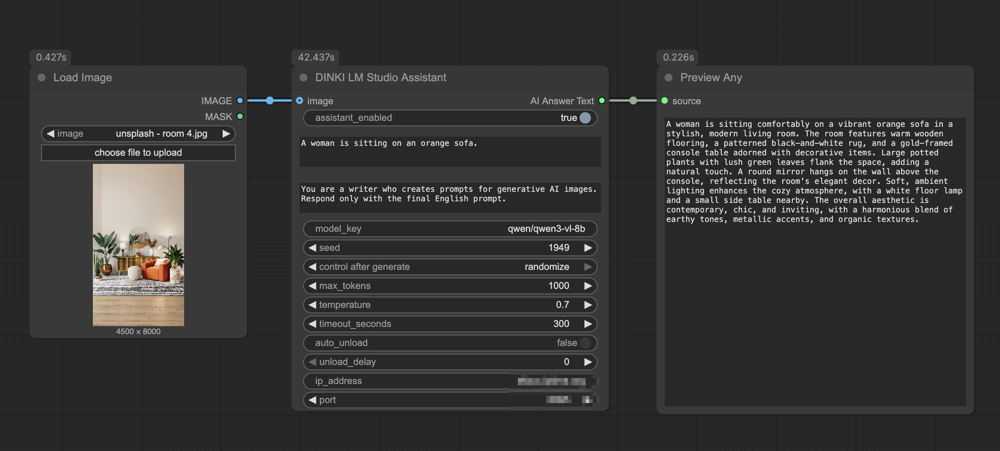
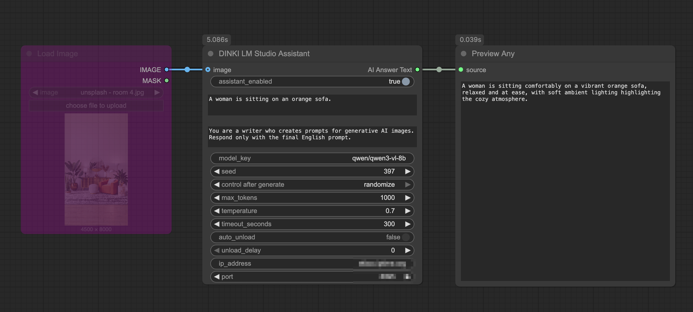
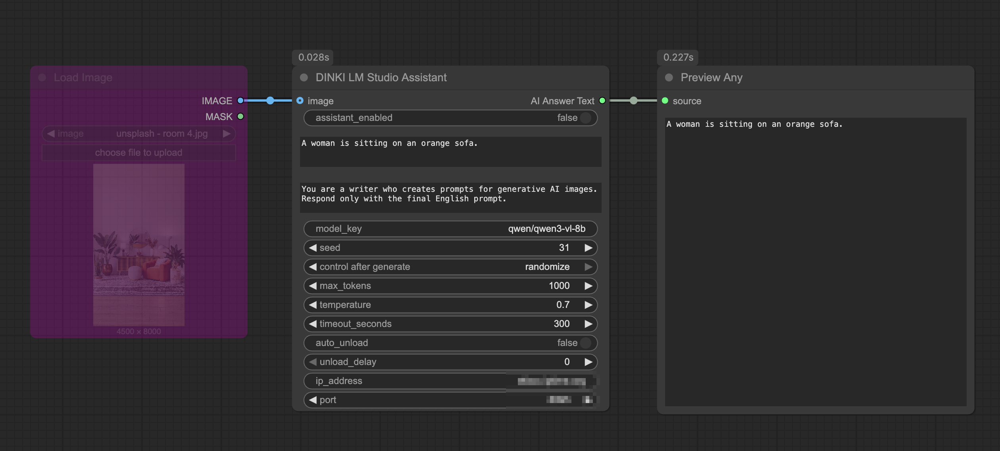

[Home](./README.md)
- [Comparison Video Tools](DINKI_Video_Tools.md)
- [Image](DINKI_Image.md)
- [Color Nodes](DINKI_Color_Nodes.md)
- [LM Studio Assistant](DINKI_LM_Studio_Assistant.md)
- [Prompts and Strings](DINKI_Prompt_and_String.md)
- [Node Utilities](DINKI_Node_Utils.md)
- [Internal Processing](DINKI_PS.md)

## 🤖 DKST LLM (LM Studio)

**DKST LLM (LM Studio)** is a powerful bridge node that connects ComfyUI directly to **LM Studio**. It enables the use of local Large Language Models (LLMs) and Vision Language Models (VLMs) within your workflows for tasks like image captioning, prompt enhancement, and creative writing.

### ✨ Key Features

* **Multimodal Capabilities:** Supports both **Text-to-Text** and **Image-to-Text** (Vision) generation.
* **Local & Private:** Runs via your LM Studio server, with optional API key authentication.
* **Batch Support:** Automatically processes image batches, sending them individually to the LLM for analysis.
* **Memory Management:** Includes an `auto_unload` feature to free up VRAM for Stable Diffusion generation after the LLM task is finished.
* **Flexible Control:** Full access to LLM parameters like `temperature`, `max_tokens`, and `system_prompt`.

### 🚀 Modes of Operation

#### 1. Vision Mode (Image + Text)
When an **image is connected**, the node operates as a Vision Assistant.
* The image is sent to the LLM along with your `user_prompt`.
* **Use Case:** Connect a Vision model (like Qwen3-VL or Gemma3) in LM Studio to caption images, describe styles, or analyze composition.
* *Note: If `user_prompt` is left empty, the LLM will default to "Describe the images."*

#### 2. Text Mode (Text Only)
When **no image is connected**, the node functions as a pure text generator.
* It generates text based solely on the `user_prompt` and `system_prompt`.
* **Use Case:** Prompt expansion, style generation, or creative writing.

#### 3. Passthrough Mode
By setting `assistant_enabled` to **False**, the node bypasses the LLM entirely and simply outputs your raw `user_prompt`. This is useful for A/B testing without removing the node.

### 🛠️ Prerequisites & Setup

1.  **Install LM Studio:** Download and install [LM Studio](https://lmstudio.ai/).
2.  **Load a Model:**
    * For **Text-only**: Load any LLM (Llama 3, Mistral, etc.).
    * For **Vision**: Load a vision-capable model (e.g., `Qwen-VL`, `LLaVA`, `BakLLaVA`).
3.  **Start Local Server:**
    * Go to the **Local Server** tab ( double arrow icon <-> ) in LM Studio.
    * Click **Start Server**.
    * Ensure the port matches the node settings (Default: `1234`).

### 🎛️ Parameters Guide

| Parameter | Description |
| :--- | :--- |
| **assistant_enabled** | Master toggle. If `False`, passes input text directly to output without calling the LLM. |
| **ip_address** | The IP of the LM Studio server (Default: `127.0.0.1`). |
| **port** | The port of the LM Studio server (Default: `1234`). |
| **api_key** | API key sent as `Authorization: Bearer …` for generation and automatic unloading. Leave empty when server authentication is disabled. |
| **model_key** | The model identifier string (e.g., `qwen/qwen3-vl-8b`). Can often be left generic depending on LM Studio version. |
| **system_prompt** | Defines the AI's persona (e.g., "You are a prompt engineer..."). |
| **user_prompt** | Your specific instruction or query. |
| **max_tokens** | Maximum output tokens (0–2,147,483,647). `0` omits the parameter and uses the server default. Actual output is limited by the model and available context. |
| **temperature** | Creativity control (0.0 = Precise/Deterministic, 1.0+ = Creative/Random). |
| **auto_unload** | If `True`, sends a request to unload the model from VRAM after generation. Essential for GPUs with limited VRAM. |
| **unload_delay** | Seconds to wait before unloading the model (if `auto_unload` is True). |

[With the DKST Image (Batch) node, you can request up to 10 image assistants from an LLM.](DINKI_Image.md#-dinki-batch-images)
