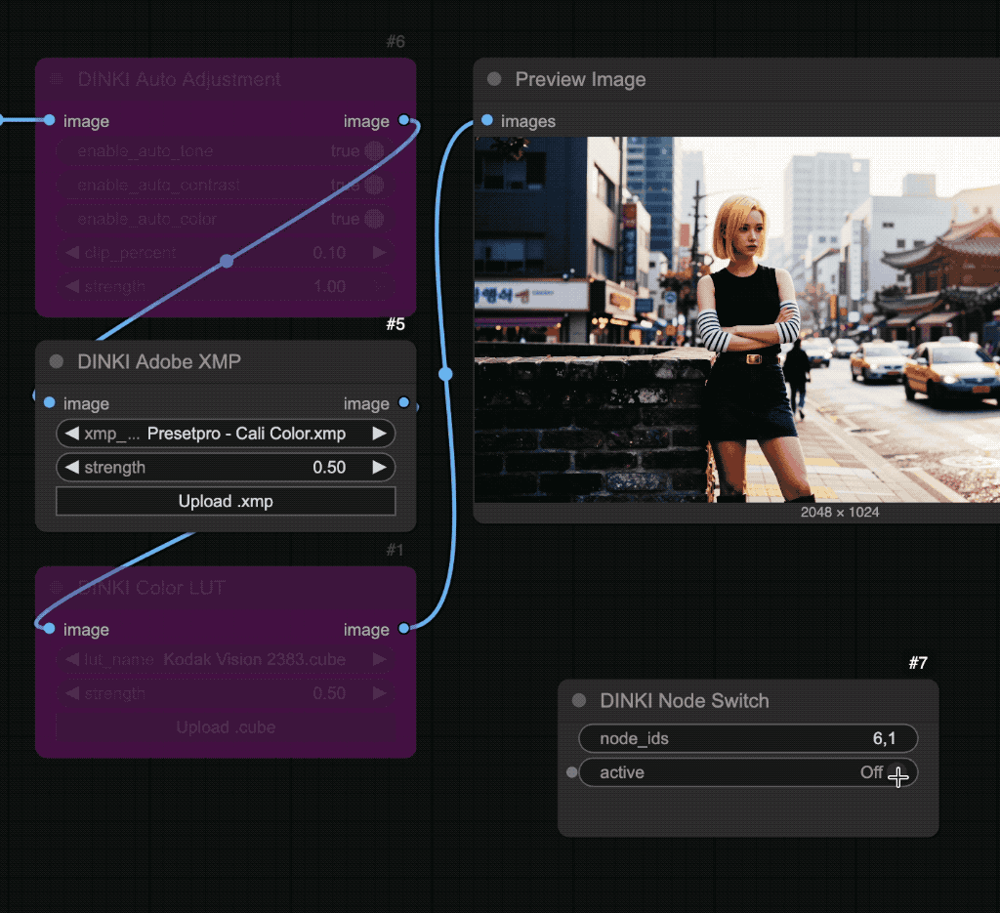
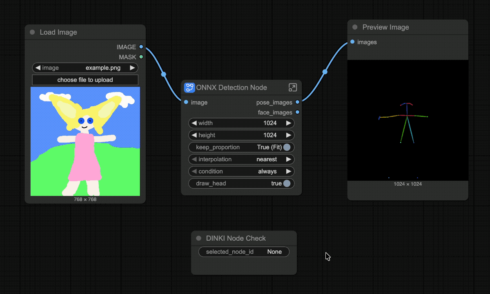

[Home](./README.md)
- [Comparison Video Tools](DINKI_Video_Tools.md)
- [Image](DINKI_Image.md)
- [Color Nodes](DINKI_Color_Nodes.md)
- [LM Studio Assistant](DINKI_LM_Studio_Assistant.md)
- [Prompts and Strings](DINKI_Prompt_and_String.md)
- [Node Utilities](DINKI_Node_Utils.md)
- [Internal Processing](DINKI_PS.md)

## 🎚️ DINKI Node Switch

A logic utility node that acts as a **remote control** for your workflow. It allows you to **toggle the Bypass status** of multiple target nodes simultaneously using a simple switch.

Perfect for creating "Control Panels" in complex workflows, allowing you to turn entire sections (like Upscaling, Face Detailer, or LoRA stacks) on or off without hunting for individual nodes.

#### ✨ Key Features

* **Remote Control:** Manage the state of any node in your graph from a single location.
* **Batch Toggling:** Control multiple nodes at once by entering a comma-separated list of Node IDs (e.g., `10, 15, 23`).
* **Workflow Optimization:** Easily disable heavy processing steps (like high-res fix) during initial testing, then re-enable them for the final render with one click.
* **Frontend Integration:** Directly interacts with the ComfyUI graph interface to visually mute/unmute nodes.

#### 💡 How to Use
1.  **Find Node IDs:** In ComfyUI settings, enable **"Show Node ID on Node"** (or right-click a node > Properties to see its ID).
2.  **Input IDs:** Enter the IDs of the nodes you want to control into the `node_ids` field (e.g., `5, 12, 44`).
3.  **Toggle:**
    * **On (True):** Target nodes are **Enabled** (Active).
    * **Off (False):** Target nodes are **Bypassed** (Muted).

### 🎛️ Inputs

| Parameter | Description |
| :--- | :--- |
| **node_ids** | A string of node IDs separated by commas (e.g., `1,2,3`). |
| **active** | The master switch. Toggles the bypass state of the defined nodes. |

---

## 🧐 DINKI Node Check

This node for quickly checking the ID of any selected node—even when the global “Show Node ID” option is turned off.

---

## 🔀 DINKI Cross Output Switch

A simple yet handy utility for A/B testing or routing logic. It swaps the two input images based on a boolean toggle.

#### 🎛️ Parameters Guide

| Parameter | Description |
| :--- | :--- |
| **image_1 / image_2** | The two input images to be swapped. |
| **invert** | **False:** Output 1 = Image 1, Output 2 = Image 2. **True:** Output 1 = Image 2, Output 2 = Image 1 (Swapped). |
