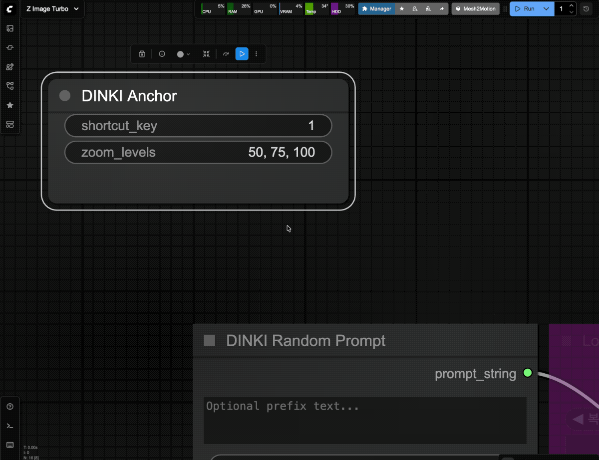
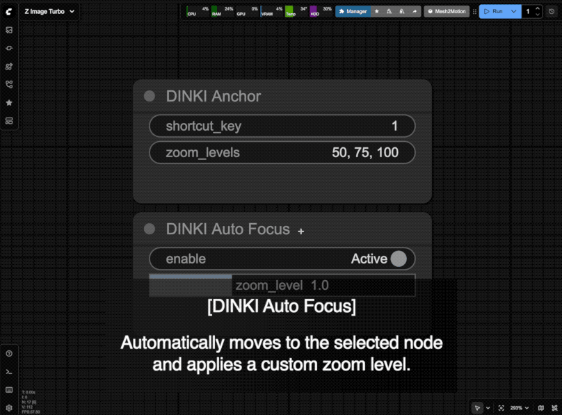
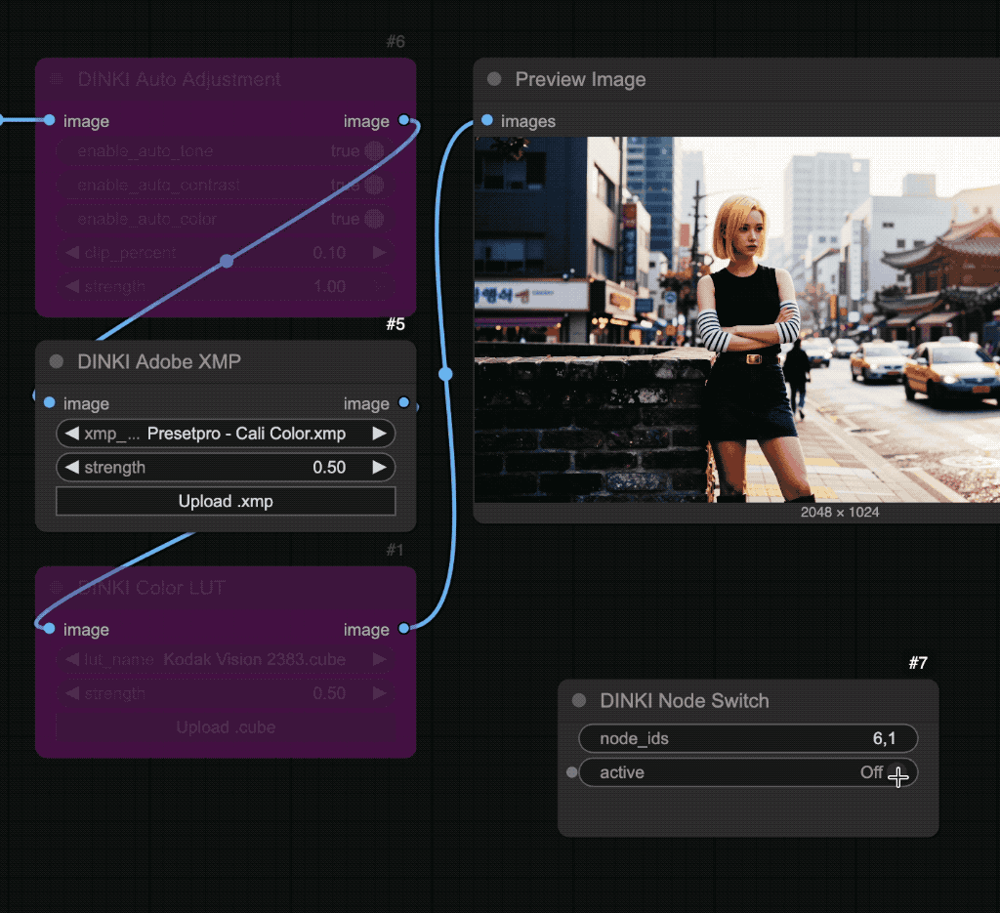
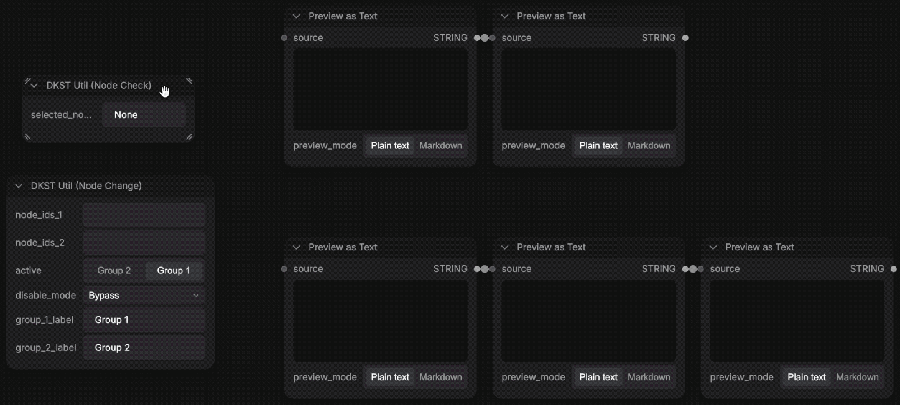
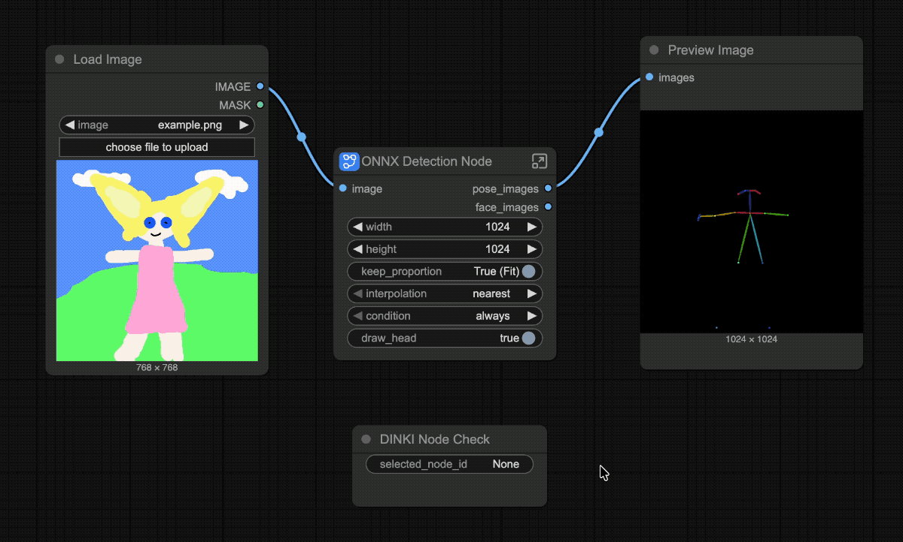

[Home](../README.md) · [All nodes](Node_Catalog.md)
- [Comparison Video Tools](DINKI_Video_Tools.md)
- [Image](DINKI_Image.md)
- [Color Nodes](DINKI_Color_Nodes.md)
- [LM Studio Assistant](DINKI_LM_Studio_Assistant.md)
- [Prompts and Strings](DINKI_Prompt_and_String.md)
- [Node Utilities](DINKI_Node_Utils.md)
- [Internal Processing](DINKI_PS.md)

## 📍 DKST Util (Anchor)
  
This node lets you quickly jump to any desired location using a hotkey, and also allows a single shortcut to cycle through multiple zoom-in and zoom-out levels sequentially.

---

## 🧭 DKST Util (Auto Focus)
  
Automatically moves to the selected node and applies a custom zoom level. It follows selection in both classic ComfyUI and Nodes 2.0, including the currently displayed subgraph. The shortcut key toggles Auto Focus on or off.

Turn on **fit** to center the selected node and fit its full width and height inside the visible canvas with a 5% margin. Fit calculates zoom from the node's current size and the canvas viewport, up to the canvas maximum zoom (or 3× when no maximum is available). With fit off, **zoom_level** controls the zoom as before. **smoothness** applies to both modes.

Turn on **restore_on_deselect** to restore only the zoom from before the first automatic focus when all nodes are deselected. The canvas stays centered on the last viewed position as the zoom changes. Changing the selection to another node keeps the original zoom for the eventual return. This option is off by default.

---

## 🎚️ DKST Util (Node Switch)
  
A logic utility node that acts as a **remote control** for your workflow. It allows you to **toggle the Bypass status** of multiple target nodes simultaneously using a simple switch.

Perfect for creating "Control Panels" in complex workflows, allowing you to turn entire sections (like Upscaling, Face Detailer, or LoRA stacks) on or off without hunting for individual nodes.

#### ✨ Key Features

* **Remote Control:** Manage the state of any node in your graph from a single location.
* **Batch Toggling:** Control multiple nodes at once by entering a comma-separated list of Node IDs (e.g., `10, 15, 23`).
* **Workflow Optimization:** Easily disable heavy processing steps (like high-res fix) during initial testing, then re-enable them for the final render with one click.
* **Frontend Integration:** Directly interacts with the ComfyUI graph interface to visually mute/unmute nodes.

#### 💡 How to Use
1.  **Find Node IDs:** In ComfyUI settings, enable **"Show Node ID on Node"** (or right-click a node > Properties to see its ID).
2.  **Input IDs:** Enter the IDs of the nodes you want to control into the `node_ids` field (e.g., `5, 12, 44`).
3.  **Toggle:**
    * **On (True):** Target nodes are **Enabled** (Active).
    * **Off (False):** Target nodes are **Bypassed** (Muted).

### 🎛️ Inputs

| Parameter | Description |
| :--- | :--- |
| **node_ids** | A string of node IDs separated by commas (e.g., `1,2,3`). |
| **active** | The master switch. Toggles the bypass state of the defined nodes. |

---

## 🔀 DKST Util (Node Change)

Switch between two groups of nodes using comma-separated IDs in `node_ids_1`
and `node_ids_2` (for example, `5, 12, 44`).

* **Group 1 / On:** Enable group 1 and disable group 2.
* **Group 2 / Off:** Disable group 1 and enable group 2.
* **disable_mode:** `Bypass` (default) passes inputs through the disabled nodes;
  `Mute` stops their execution and output. Use Mute to exclude a text branch from
  DKST Text (Concatenate).
* **group_1_label / group_2_label:** Customize the toggle's two labels, including
  promoted subgraph controls. Empty names fall back to Group 1 / Group 2.
* Enabled nodes use normal execution mode. Existing workflows default to Bypass.
* Empty fields and unknown IDs are ignored. IDs in both groups stay enabled.
* The control ignores its own ID and resolves targets within its own graph/subgraph.
* Supports classic widgets and Nodes 2.0. Saved settings apply when a workflow loads.
* Controls promoted to a subgraph's outer interface are synchronized within about
  100 ms, including nested subgraphs. Target IDs still refer to the control's own
  graph. The selected group is reapplied after tab switches and workflow loads;
  unchanged target modes do not trigger redraws.

This control changes node modes in the ComfyUI frontend, like Node Switch.
For predictable results, avoid targeting the same node with conflicting controls.

---

## 🕵️ DKST Util (Node Check)
  
This node for quickly checking the ID of any selected node—even when the global “Show Node ID” option is turned off.

---

## 🔀 DKST Util (Cross Switch)

A simple yet handy utility for A/B testing or routing logic. It swaps the two input images based on a boolean toggle.

#### 🎛️ Parameters Guide

| Parameter | Description |
| :--- | :--- |
| **image_1 / image_2** | The two input images to be swapped. |
| **invert** | **False:** Output 1 = Image 1, Output 2 = Image 2. **True:** Output 1 = Image 2, Output 2 = Image 1 (Swapped). |

---

## DKST Util (Note)

Choose a `direction` arrow and enter multiline `text` to annotate the workflow. The node also passes that text to its `text_out` STRING output.
