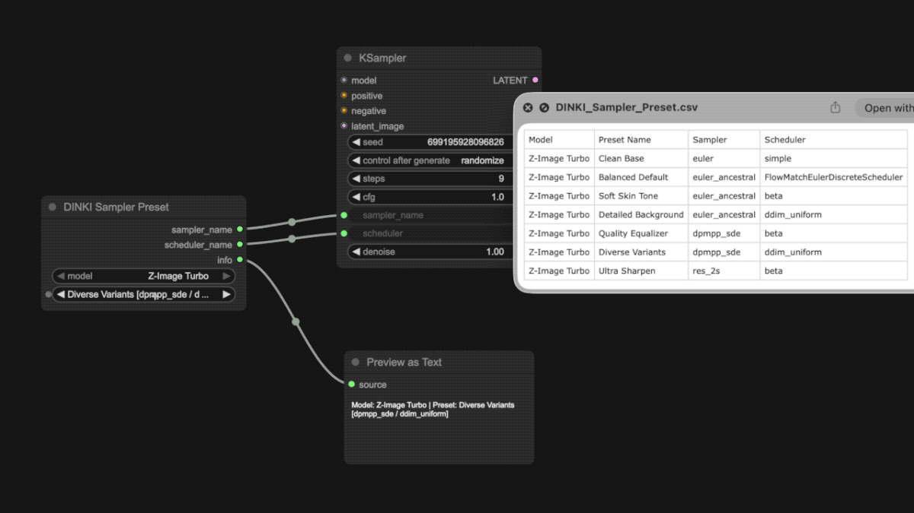
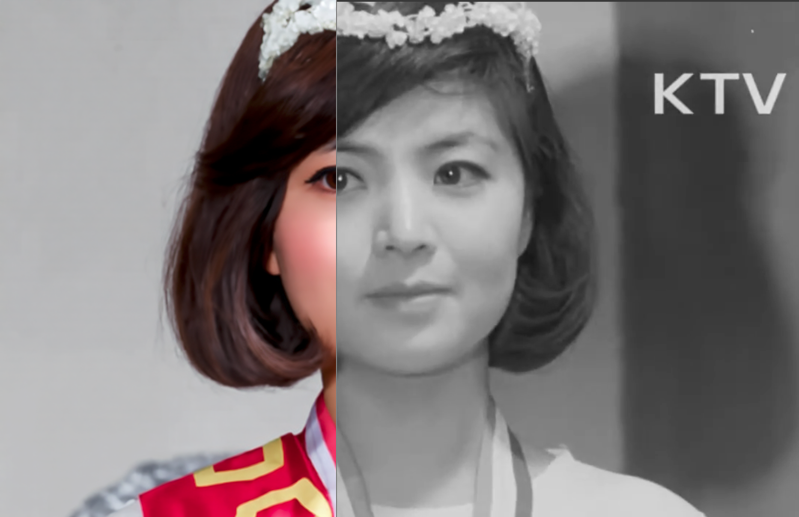
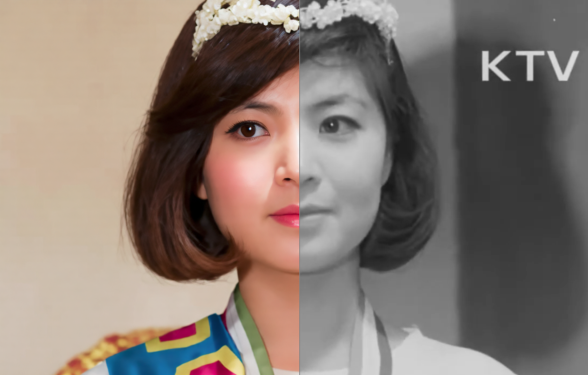
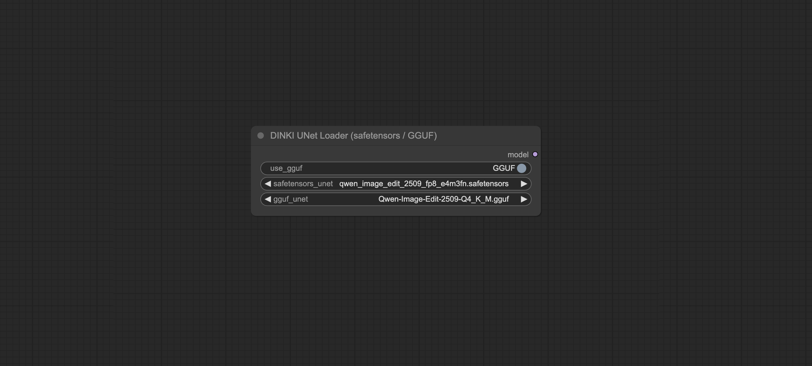

[Home](../README.md) · [All nodes](Node_Catalog.md)
- [Comparison Video Tools](DINKI_Video_Tools.md)
- [Image](DINKI_Image.md)
- [Color Nodes](DINKI_Color_Nodes.md)
- [LM Studio Assistant](DINKI_LM_Studio_Assistant.md)
- [Prompts and Strings](DINKI_Prompt_and_String.md)
- [Node Utilities](DINKI_Node_Utils.md)
- [Internal Processing](DINKI_PS.md)

## 🧩 DKST PS (Tile Split) / DKST PS (Tile Stitch)
#### (!! Feature in development)

These nodes let an image-edit workflow upscale one image in overlapping tiles. **Tile Split** sends individual `IMAGE` values as a ComfyUI list, not as one image batch. This matters for Qwen Image 2.1: its `Text Encode Qwen Image 2.1` node reads only the first image from an `IMAGE` batch connected to one reference slot.

Connect the nodes as follows:

1. Send one image to **Tile Split**. Start with `tile_size=1024`, `overlap=128`, and `upscale_factor=2.0`. The node enlarges the complete source image once, then cuts the enlarged image into overlapping tiles.
2. Connect `tiles` to `Text Encode Qwen Image 2.1` → `image_1` in the image-edit workflow. Connect `qwen_resolution` to its `resolution` input. If you use an **Image Edit (Qwen Image 2.1)** subgraph that exposes `width`, `height`, and `custom_size` instead, connect `qwen_resolution` to both dimensions **and turn on `custom_size`**. Use the same edit prompt for all tiles.
3. Connect `tile_seeds` to the sampler's `seed` input. If the seed is a widget, convert it to an input. Keep the Qwen conditioning → sampler → VAE decode path between the two DKST nodes.
4. Connect decoded `IMAGE` values to **Tile Stitch** → `processed_tiles`, and connect `tile_layout` only to **Tile Stitch**. Do not connect `tile_layout` to a Qwen reference image input. The output is one stitched image.

`tile_size` measures the tile's coverage in original-image pixels. `upscale_factor` sets the actual tile input and output size, rounded to a multiple of 32; both the `tiles` images and `qwen_resolution` are already that size. Do not resize tiles again before Qwen. This lets Qwen edit each tile at the same input and output resolution. `overlap` is the minimum intended overlap in original-image pixels; evenly spaced final tiles can overlap much more when the image is only slightly larger than a tile. The optional `blend_width` controls how much of that overlap is actually feathered (default 32 original-image pixels, capped at `overlap`). The first tile uses `seed`, and following tiles use `seed + tile index`. Each tile must return one square image at `qwen_resolution` and remain in its original order. The stitch node rejects missing or wrongly sized outputs; it cannot detect a change in tile order from pixel content.

The stitch node uses cosine-weighted blending near each tile seam and trims any padding added around small input images. It blends RGBA tiles in premultiplied-alpha space. When the actual overlap is much larger than requested, it places the seam near the earlier tile's far edge so one generated version covers most of the shared area. For a 1200×1500 input with 1024-pixel tiles, the actual overlaps are 848 pixels horizontally and 548 pixels vertically; `blend_width=32` limits the blended parts to 32 input pixels near each seam.

Qwen Image 2.1's official edit workflow samples from an empty latent with full denoise. It can move facial features independently in each tile. Stitching cannot reconnect features that have moved to different coordinates. A prompt that explicitly preserves the original composition helps, but portraits may need a larger tile that keeps the whole face together or an image-to-image refinement workflow anchored to a pre-upscaled image.

For a 1024-pixel input tile and 2048-pixel output tile, the final image is 2× the input dimensions. Larger Qwen resolutions require more VRAM, and the split tiles plus stitched output occupy system RAM. The ComfyUI list output processes tiles one at a time through ordinary nodes rather than increasing the model's batch size.

### 🗂️ DKST Util (Sampler Preset)

This node simplifies the often confusing task of selecting the correct **Sampler** and **Scheduler** pairs for different diffusion models. Instead of manually selecting them every time, this node reads from a customizable CSV database to provide "Golden Settings" or recommended presets for models like SDXL, Flux, Pony, and more.

It features a **Dynamic Javascript UI** that automatically filters the preset list based on the model you select.

#### 💡 Why use this?
* **No More Guessing:** eliminates the risk of using incompatible samplers (e.g., using an SD1.5 sampler on a Flux model).
* **Workflow Cleanliness:** Replaces two separate dropdown widgets with a single, logical preset selector.
* **Customizable:** You can add your own favorite combinations by editing the accompanying CSV file.



#### 🎛️ Parameters Guide

| Parameter | Description |
| :--- | :--- |
| **model** | Selects the category of the model (e.g., `Qwen-Image`, `Flux.1`, `Z-Image`). This selection filters the available options in the `preset` dropdown. |
| **preset** | Selects the specific configuration. The UI displays the preset name along with the actual sampler/scheduler values (e.g., `Quality [dpmpp_2m / karras]`). |

#### 🔌 Outputs

| Output | Description |
| :--- | :--- |
| **sampler_name** | Outputs the sampler string (e.g., `euler`, `dpmpp_2m`). Connect this to any KSampler or SamplerCustom node. |
| **scheduler_name** | Outputs the scheduler string (e.g., `normal`, `karras`, `simple`). |
| **info** | Returns a string summary of the current selection for debugging or text display. |

#### 📝 How to Customize (CSV)
You can add your own presets by editing the file located at:
`csv/DINKI_Sampler_Preset.csv` beside `dinki_prompt.py` in the installed node folder.

**CSV Format:**
```csv
Model, Preset Name, Sampler, Scheduler
Flux.1, Dev Standard, euler, simple
SDXL, Lightning 4-Step, dpmpp_sde, karras
Pony, Realism, dpmpp_2m, karras
```

---


### 📐 DKST PS (Resize & Pad) / DKST PS (Remove Padding)

This pair of nodes is essential for workflows involving image editing models (like **Qwen Image Edit**) that are sensitive to aspect ratio changes or resolution resizing.

**1. DKST PS (Resize & Pad)** Resizes an input image to fit within a target square resolution (default **1024×1024**) while *preserving the original aspect ratio*. It automatically adds padding (letterboxing) to fill the remaining space.

**2. DKST PS (Remove Padding)** Takes the processed image and the `PAD_INFO` from the first node to crop the padding out, restoring the original image area after processing. Pixel rounding can cause a small difference in the final aspect ratio.

#### 💡 Why use this?
This workflow prevents **pixel shifting artifacts** and distortion in models like Qwen Image Edit. It ensures that prompt-based editing requests are processed as accurately as possible by maintaining the subject's original proportions throughout the generation process.

#### Comparison
**Without Resize and Pad (Distorted/Shifted):**


**With DINKI Resize and Pad (Accurate):**


#### 🎛️ Parameters Guide

**DKST PS (Resize & Pad)**
| Parameter | Description |
| :--- | :--- |
| **target_size** | The target resolution for the square canvas (e.g., 1024). The longest side of the image will fit this size. |
| **resolution_multiple** | Rounds `target_size` to this multiple before resizing and padding (default 32). |
| **resize_and_pad** | **True:** Applies resizing and padding.<br>**False:** Bypasses the node (returns original image). |
| **upscale_method** | Algorithm used for resizing (lanczos, bicubic, area, nearest). |

**DKST PS (Remove Padding)**
| Parameter | Description |
| :--- | :--- |
| **pad_info** | Connect the `PAD_INFO` output from the *Resize and Pad* node here. Contains cropping metadata. |
| **latent_scale** | (Optional) Connect the `latent_scale` output from **DKST PS (Latent Upscale)**. <br>Allows correct cropping even if the image was upscaled in latent space (e.g., during High-Res Fix). |
| **remove_pad** | **True:** Crops the padding.<br>**False:** Returns the input image as-is. |


---


## ⬆️ DKST PS (Latent Upscale)

An enhanced latent upscaling node designed for flexibility and pipeline integration. It features a "Snap to Multiple" function to prevent odd-resolution errors.

#### 🎛️ Parameters Guide

| Parameter | Description |
| :--- | :--- |
| **scale_by** | The multiplier for upscaling (e.g., 1.5x). |
| **snap_to_multiple** | Ensures the resulting resolution is a multiple of this number (default 8). Prevents "odd dimension" errors in VAEs. |
| **enabled** | **True:** Performs upscaling.<br>**False:** Bypasses the node (returns original latent). |
| **upscale_method** | Algorithm for latent interpolation (nearest-exact, bicubic, etc.). |

> **Output Note:** The `latent_scale` output provides the *actual* scaling factor used (after snapping), which can be sent to **DKST PS (Remove Padding)**.


---


## 🧠 DKST PS (UNet Loader)

A streamlined loader that combines **safetensors** and **GGUF** model loading into a single node. This removes the need to place separate loader nodes and rewire connections when switching between standard and quantized models.



#### 🎛️ Parameters Guide

| Parameter | Description |
| :--- | :--- |
| **use_gguf** | **True (GGUF):** Loads the model selected in `gguf_unet`.<br>**False (safetensors):** Loads the model selected in `safetensors_unet`. |
| **safetensors_unet** | Select a standard model from `models/diffusion_models`. |
| **gguf_unet** | Select a quantized model from `models/unet_gguf`. |

GGUF loading requires the separate ComfyUI-GGUF custom node (`UnetLoaderGGUF` or `UnetLoaderGGUFAdvanced`). Selecting `None` for the active loader raises an error.

---

## DKST PS (Mask Mix)

Connect up to five optional `mask_1`–`mask_5` inputs. Each matching `strength_1`–`strength_5` scales its mask from 0 to 1. The node resizes later masks to the first connected mask's dimensions and combines them with a pixelwise maximum. With no masks, `mixed_mask` is a 64×64 zero mask.

## DKST PS (Latent Source)

In `Auto` mode with an `image` connected, the node encodes it using `vae` and returns a `LATENT` plus the configured `denoise` value. Without an image, or in `Bypass` mode, it returns an empty latent of `width` × `height` and `batch_size`, with denoise forced to `1.0`. Connect the denoise output to the sampler to keep the two modes in sync.
