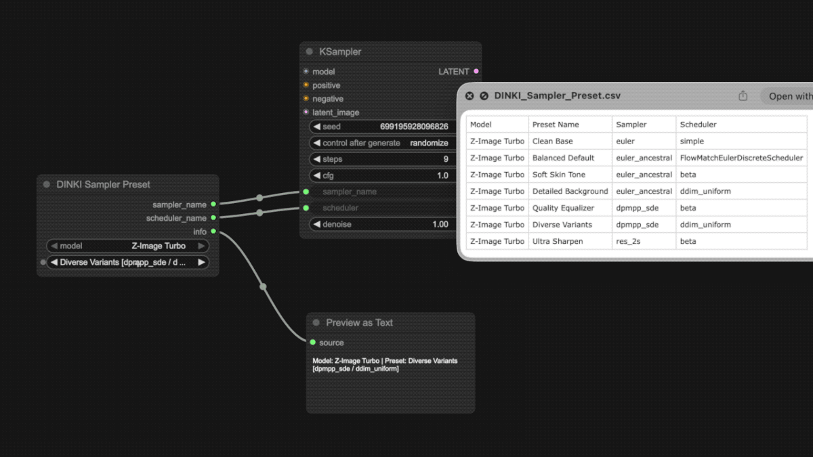
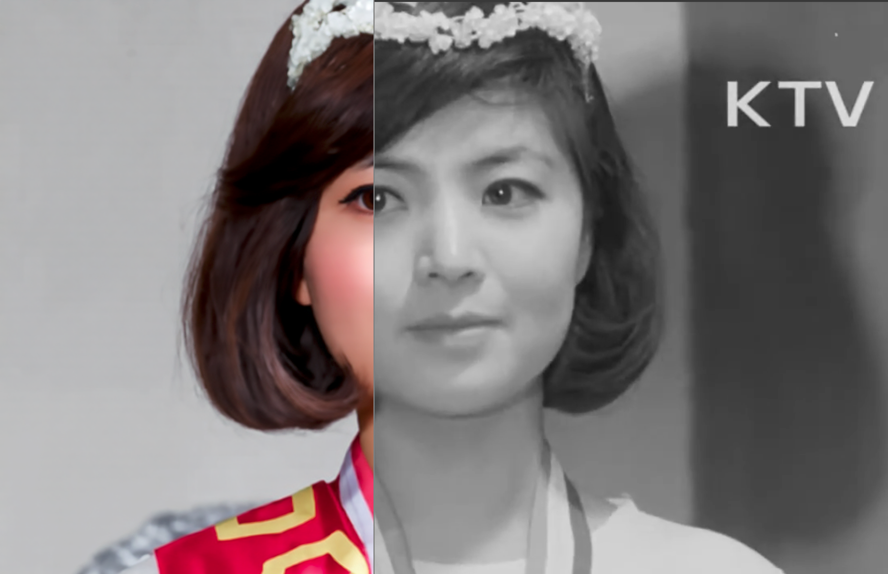
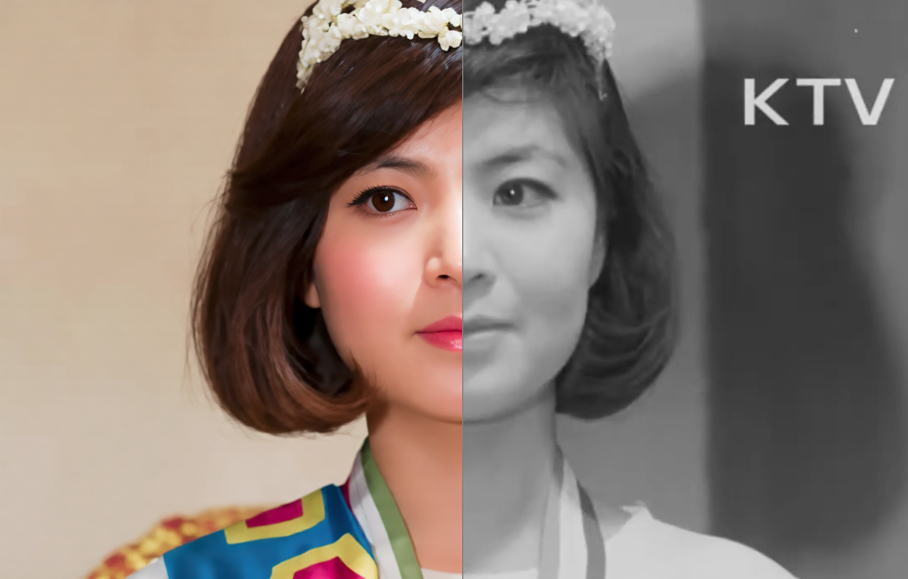
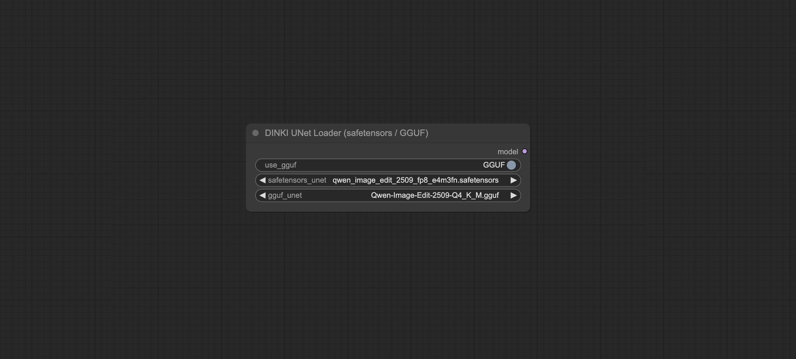

[Home](../README.md) · [All nodes](Node_Catalog.md)
- [Comparison Video Tools](DINKI_Video_Tools.md)
- [Image](DINKI_Image.md)
- [Color Nodes](DINKI_Color_Nodes.md)
- [LM Studio Assistant](DINKI_LM_Studio_Assistant.md)
- [Prompts and Strings](DINKI_Prompt_and_String.md)
- [Node Utilities](DINKI_Node_Utils.md)
- [Internal Processing](DINKI_PS.md)

## Image upscaling and tiled processing

For image enlargement without a diffusion redraw, use ComfyUI's built-in **Load Upscale Model** and **Upscale Image (using Model)**. The model upscaler already processes overlapping tiles internally; separate split/stitch nodes are unnecessary. See the [ComfyUI implementation](https://github.com/Comfy-Org/ComfyUI/blob/master/comfy_extras/nodes_upscale_model.py).

**VAE Encode (Tiled)** and **VAE Decode (Tiled)** reduce memory use during image/latent conversion. They do not enlarge an image by themselves or tile the diffusion sampler. See the [ComfyUI VAE nodes](https://github.com/Comfy-Org/ComfyUI/blob/master/nodes.py).

For diffusion refinement of an enlarged image, consider [Ultimate SD Upscale](https://github.com/ssitu/ComfyUI_UltimateSDUpscale) or [Tiled Diffusion & VAE](https://github.com/comfyorg/comfyui-tiled-diffusion). These use different sampling strategies; verify compatibility with the model and conditioning in your workflow. Tiled Diffusion's documented support lists SD1.x, SD2.x, SDXL, SD3 and FLUX, but does not list Qwen Image.

### 🗂️ DKST Util (Sampler Preset)

This node simplifies the often confusing task of selecting the correct **Sampler** and **Scheduler** pairs for different diffusion models. Instead of manually selecting them every time, this node reads from a customizable CSV database to provide "Golden Settings" or recommended presets for models like SDXL, Flux, Pony, and more.

It features a **Dynamic Javascript UI** that automatically filters the preset list based on the model you select.

#### 💡 Why use this?
* **No More Guessing:** eliminates the risk of using incompatible samplers (e.g., using an SD1.5 sampler on a Flux model).
* **Workflow Cleanliness:** Replaces two separate dropdown widgets with a single, logical preset selector.
* **Customizable:** You can add your own favorite combinations by editing the accompanying CSV file.



#### 🎛️ Parameters Guide

| Parameter | Description |
| :--- | :--- |
| **model** | Selects the category of the model (e.g., `Qwen-Image`, `Flux.1`, `Z-Image`). This selection filters the available options in the `preset` dropdown. |
| **preset** | Selects the specific configuration. The UI displays the preset name along with the actual sampler/scheduler values (e.g., `Quality [dpmpp_2m / karras]`). |

#### 🔌 Outputs

| Output | Description |
| :--- | :--- |
| **sampler_name** | Outputs the sampler string (e.g., `euler`, `dpmpp_2m`). Connect this to any KSampler or SamplerCustom node. |
| **scheduler_name** | Outputs the scheduler string (e.g., `normal`, `karras`, `simple`). |
| **info** | Returns a string summary of the current selection for debugging or text display. |

#### 📝 How to Customize (CSV)
You can add your own presets by editing the file located at:
`csv/DINKI_Sampler_Preset.csv` beside `dinki_prompt.py` in the installed node folder.

**CSV Format:**
```csv
Model, Preset Name, Sampler, Scheduler
Flux.1, Dev Standard, euler, simple
SDXL, Lightning 4-Step, dpmpp_sde, karras
Pony, Realism, dpmpp_2m, karras
```

---


### 📐 DKST PS (Resize & Pad) / DKST PS (Remove Padding)

This pair of nodes is essential for workflows involving image editing models (like **Qwen Image Edit**) that are sensitive to aspect ratio changes or resolution resizing.

**1. DKST PS (Resize & Pad)** Resizes an input image to fit within a target square resolution (default **1024×1024**) while *preserving the original aspect ratio*. It automatically adds padding (letterboxing) to fill the remaining space.

**2. DKST PS (Remove Padding)** Takes the processed image and the `PAD_INFO` from the first node to crop the padding out, restoring the original image area after processing. Pixel rounding can cause a small difference in the final aspect ratio.

#### 💡 Why use this?
This workflow prevents **pixel shifting artifacts** and distortion in models like Qwen Image Edit. It ensures that prompt-based editing requests are processed as accurately as possible by maintaining the subject's original proportions throughout the generation process.

#### Comparison
**Without Resize and Pad (Distorted/Shifted):**


**With DINKI Resize and Pad (Accurate):**


#### 🎛️ Parameters Guide

**DKST PS (Resize & Pad)**

RGBA inputs retain their alpha through resizing, padding, and the matching Remove Padding node. The added black padding is opaque.

| Parameter | Description |
| :--- | :--- |
| **target_size** | The target resolution for the square canvas (e.g., 1024). The longest side of the image will fit this size. |
| **resolution_multiple** | Rounds `target_size` to this multiple before resizing and padding (default 32). |
| **resize_and_pad** | **True:** Applies resizing and padding.<br>**False:** Bypasses the node (returns original image). |
| **upscale_method** | Algorithm used for resizing (lanczos, bicubic, area, nearest). |

**DKST PS (Remove Padding)**
| Parameter | Description |
| :--- | :--- |
| **pad_info** | Connect the `PAD_INFO` output from the *Resize and Pad* node here. Contains cropping metadata. |
| **latent_scale** | (Optional) Connect the `latent_scale` output from **DKST PS (Latent Upscale)**. <br>Allows correct cropping even if the image was upscaled in latent space (e.g., during High-Res Fix). |
| **remove_pad** | **True:** Crops the padding.<br>**False:** Returns the input image as-is. |


---


## ⬆️ DKST PS (Latent Upscale)

An enhanced latent upscaling node designed for flexibility and pipeline integration. It features a "Snap to Multiple" function to prevent odd-resolution errors.

#### 🎛️ Parameters Guide

| Parameter | Description |
| :--- | :--- |
| **scale_by** | The multiplier for upscaling (e.g., 1.5x). |
| **snap_to_multiple** | Ensures the resulting resolution is a multiple of this number (default 8). Prevents "odd dimension" errors in VAEs. |
| **enabled** | **True:** Performs upscaling.<br>**False:** Bypasses the node (returns original latent). |
| **upscale_method** | Algorithm for latent interpolation (nearest-exact, bicubic, etc.). |

> **Output Note:** The `latent_scale` output provides the *actual* scaling factor used (after snapping), which can be sent to **DKST PS (Remove Padding)**.


---


## 🧠 DKST PS (UNet Loader)

A streamlined loader that combines **safetensors** and **GGUF** model loading into a single node. This removes the need to place separate loader nodes and rewire connections when switching between standard and quantized models.



#### 🎛️ Parameters Guide

| Parameter | Description |
| :--- | :--- |
| **use_gguf** | **True (GGUF):** Loads the model selected in `gguf_unet`.<br>**False (safetensors):** Loads the model selected in `safetensors_unet`. |
| **safetensors_unet** | Select a standard model from `models/diffusion_models`. |
| **gguf_unet** | Select a quantized model from `models/unet_gguf`. |

GGUF loading requires the separate ComfyUI-GGUF custom node (`UnetLoaderGGUF` or `UnetLoaderGGUFAdvanced`). Selecting `None` for the active loader raises an error.

---

## DKST PS (Multi LoRA Loader)

Connect a `MODEL`, then add LoRA rows with **+ Add LoRA**. Each row has a remove button, a LoRA dropdown, an On switch, **↑ / ↓** buttons for moving the row, and a `strength_model` number input accepting -100 to 100. The arrow at either end of the stack is disabled when there is no row to move to. Adding rows preserves the node's current width and any extra height. Enabled rows are applied from top to bottom in the order shown; off rows, `None`, and zero strength are bypassed. The node outputs only the modified `MODEL`. It does not change CLIP. LoRA files come from ComfyUI's `models/loras` folders; refresh the node list after adding files.

This node uses ComfyUI's standard model-only LoRA loader, so each file must match the input model and a key format that loader supports. For models exposing standard weight patches, the server log reports how many patches each active LoRA adds. If an active file adds no model weight patches, execution stops with its filename and a compatibility error instead of continuing without the selected LoRA. Patch counts do not verify tensor shapes or generation quality. Disabling every row passes the input model through, including any LoRAs already applied upstream.

Saved workflows retain the full list, including disabled rows. Execution requests contain only enabled, nonzero rows with a selected file, so editing or reordering bypassed rows does not change the LoRA input used for ComfyUI's execution cache. For output comparisons, keep the seed and all sampling settings fixed; queueing with a changing seed still produces a different execution request.

---

## DKST PS (Mask Mix)

Connect up to five optional `mask_1`–`mask_5` inputs. Each matching `strength_1`–`strength_5` scales its mask from 0 to 1. The node resizes later masks to the first connected mask's dimensions and combines them with a pixelwise maximum. With no masks, `mixed_mask` is a 64×64 zero mask.

## DKST PS (Latent Source)

In `Auto` mode with an `image` connected, the node encodes it using `vae` and returns a `LATENT` plus the configured `denoise` value. Without an image, or in `Bypass` mode, it returns an empty latent of `width` × `height` and `batch_size`, with denoise forced to `1.0`. Connect the denoise output to the sampler to keep the two modes in sync.
