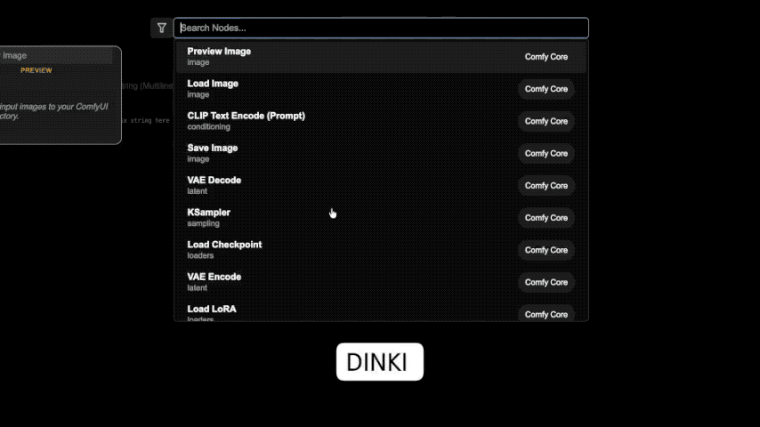

[Home](./README.md)
- [Comparison Video Tools](DINKI_Video_Tools.md)
- [Image](DINKI_Image.md)
- [Color Nodes](DINKI_Color_Nodes.md)
- [LM Studio Assistant and Batch Images](DINKI_LM_Studio_Assistant.md)
- [Prompts and Strings](DINKI_Prompt_and_String.md)
- [Node Utilities](DINKI_Node_Utils.md)
- [Internal Processing](DINKI_PS.md)

## 🎲 DINKI Random Prompt


A versatile prompt generator that builds complex prompts using a custom CSV file. It allows you to organize tags by category and offers granular control over each section—choose a specific tag, randomize it, or skip it entirely.

* **Setup:** Ensure your CSV file is located at `~/ComfyUI/custom_nodes/ComfyUI-DINKIssTyle/csv/DINKI_Random_Prompt.csv`.
* **CSV Format:** `Category, Tag/Prompt`
    ```csv
    Art Style, Cyberpunk
    , Steampunk
    Camera, 35mm lens
    , Wide angle
    ```
* **Dynamic Controls:** The node automatically creates dropdown menus for every unique category found in the CSV file.

#### 🎛️ Parameters Guide

| Parameter | Description |
| :--- | :--- |
| **text_input** | (Optional) Fixed text to appear at the beginning of the prompt (e.g., "masterpiece, best quality"). |
| **seed** | Controls the random selection. Keep the seed fixed to reproduce the same "random" combination. |
| **[Category Name]** | Dynamic dropdowns generated from your CSV categories. <br>• **Specific Value**: Manually select a specific tag.<br>• **-- Random --**: Randomly picks one tag from this category.<br>• **-- None --**: Skips this category entirely. |


---


## 🔀 DINKI String Switch RT



A real-time text utility that converts multi-line text input into a dynamic dropdown menu. It allows you to switch between different text segments (such as prompt variations, styles, or parameters) instantly without disconnecting wires.

* **Dynamic Parsing:** Simply type into the `input_text` field. The node automatically splits the text by new lines (`\n`) to populate the selection menu.
* **Real-Time Sync:** Updates the dropdown list instantly as you type. * This node currently does not support real-time updates in Nodes 2.0.
* **Flexible Output:** Can operate as a standalone selector or concatenate with an incoming text stream.

#### 🎛️ Parameters Guide

| Parameter | Description |
| :--- | :--- |
| **select_string** | The dynamically generated dropdown menu. Selects one line from the text list below. |
| **input_text** | Enter your text options here. **Each new line creates a new option** in the dropdown list immediately. |
| **text_in** | (Optional) Input text to be prepended to the selected output. <br>• If connected: Output = `text_in, selected_string`<br>• If empty: Output = `selected_string` |


---


## 📝 DINKI CSV Prompt Selector (Live)

Quickly insert frequently used prompts or LoRA triggers by selecting them from a dropdown menu.

* **Setup:** Create a file named **`prompt_list.csv`** inside your ComfyUI **`input`** folder.
* **CSV Format:** `Title, Prompt Text`
    ```csv
    LoRA - ToonWorld, ToonWorld
    LoRA - Photo to Anime, transform into anime
    ```
* **Live Update:** The node refreshes the list from the CSV file automatically on every run.

#### 🎛️ Parameters Guide

| Parameter | Description |
| :--- | :--- |
| **title** | Select the key/title defined in your CSV file. The node outputs the corresponding prompt text. |
