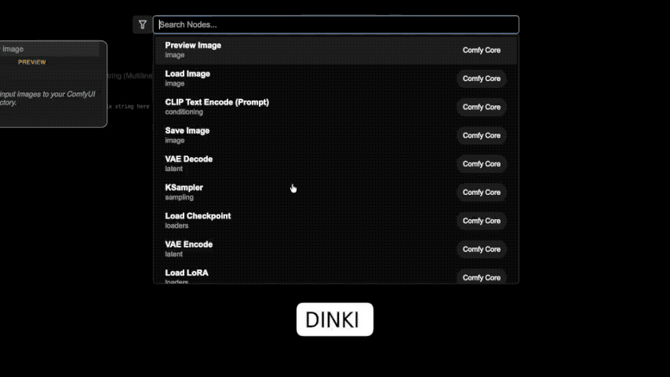

[Home](../README.md) · [All nodes](Node_Catalog.md)
- [Comparison Video Tools](DINKI_Video_Tools.md)
- [Image](DINKI_Image.md)
- [Color Nodes](DINKI_Color_Nodes.md)
- [LM Studio Assistant](DINKI_LM_Studio_Assistant.md)
- [Prompts and Strings](DINKI_Prompt_and_String.md)
- [Node Utilities](DINKI_Node_Utils.md)
- [Internal Processing](DINKI_PS.md)

## 🎲 DKST Prompt (Random)


A versatile prompt generator that builds complex prompts using a custom CSV file. It allows you to organize tags by category and offers granular control over each section—choose a specific tag, randomize it, or skip it entirely.

* **Setup:** Edit `csv/DINKI_Random_Prompt.csv` beside `dinki_prompt.py` in the installed node folder.
* **CSV Format:** `Category, Tag/Prompt`
    ```csv
    Art Style, Cyberpunk
    , Steampunk
    Camera, 35mm lens
    , Wide angle
    ```
* **Dynamic Controls:** The node automatically creates dropdown menus for every unique category found in the CSV file.

#### 🎛️ Parameters Guide

| Parameter | Description |
| :--- | :--- |
| **text_input** | (Optional) Fixed text to appear at the beginning of the prompt (e.g., "masterpiece, best quality"). |
| **Active** | When off, output only `text_input` without selecting CSV entries. |
| **seed** | Controls the random selection. Keep the seed fixed to reproduce the same "random" combination. |
| **[Category Name]** | Dynamic dropdowns generated from your CSV categories. <br>• **Specific Value**: Manually select a specific tag.<br>• **-- Random --**: Randomly picks one tag from this category.<br>• **-- None --** (default): Skips this category entirely. |


---


## 🔀 DKST Util (String Switch)



A real-time text utility that converts multi-line text input into a dynamic dropdown menu. It allows you to switch between different text segments (such as prompt variations, styles, or parameters) instantly without disconnecting wires.

* **Dynamic Parsing:** Simply type into the `input_text` field. The node automatically splits the text by new lines (`\n`) to populate the selection menu.
* **Real-Time Sync:** Updates the dropdown list instantly as you type. * This node currently does not support real-time updates in Nodes 2.0.
* **Flexible Output:** Can operate as a standalone selector or concatenate with an incoming text stream.

#### 🎛️ Parameters Guide

| Parameter | Description |
| :--- | :--- |
| **select_string** | The dynamically generated dropdown menu. Selects one line from the text list below. |
| **input_text** | Enter your text options here. **Each new line creates a new option** in the dropdown list immediately. |
| **text_in** | (Optional) Input text to be prepended to the selected output. <br>• If connected: Output = `text_in, selected_string`<br>• If empty: Output = `selected_string` |


---


## 📝 DKST Prompt (CSV Selector Live)

Quickly insert frequently used prompts or LoRA triggers by selecting them from a dropdown menu.

* **Setup:** Edit `csv/DINKI_Prompt_List.csv` beside `dinki_prompt.py` in the installed node folder.
* **CSV Format:** `Title, Prompt Text`
    ```csv
    LoRA - ToonWorld, ToonWorld
    LoRA - Photo to Anime, transform into anime
    ```
* **Live Update:** The node refreshes the list from the CSV file automatically on every run.
* **Subgraphs:** Selecting a promoted title on the outer node updates the inner
  text and any promoted text field (including renamed fields such as `text_1`).
  Nested subgraphs and both legacy and Nodes 2.0 widgets are supported. Changes
  without a widget callback are detected within about 100 ms, then the preset is
  fetched. Append/replace uses the outer mode, separator, and current text when
  those fields are promoted. Loading a saved workflow does not append again.

#### 🎛️ Parameters Guide

| Parameter | Description |
| :--- | :--- |
| **title** | Select the key/title defined in your CSV file; `-- None --` clears the selection. |
| **text** | Editable text that the node outputs. The frontend updates it from the selected CSV value. |
| **mode** | `append`, `replace`, or `none` when a title is selected. |
| **separator** | Text inserted between the current text and an appended prompt; the default is `\n`. |

## DKST Prompt (CSV Selector)

Uses the same `csv/DINKI_Prompt_List.csv` file and exposes only `title`. It looks up the selected title when the workflow runs and returns its prompt, or an empty string for `-- None --`.

---

## DKST Text (Multiline)

Enter multiline `text` and pass it through as a `STRING` output.

## DKST Text (Split)

Split the input `text` at the exact `delimiter` (default `,`) into `text_1`–`text_10`. `clean_whitespace` trims each piece by default. Empty pieces retain their positions, and the tenth output contains any remaining text. An empty delimiter leaves the text intact; use an actual line break as the delimiter to split lines.

## DKST Text (Concatenate)

Connect any of `text_a`–`text_j` and join the nonempty inputs in slot order using `delimiter` (default `, `). `clean_whitespace` trims connected values before joining by default. Disconnected and empty values are skipped.
