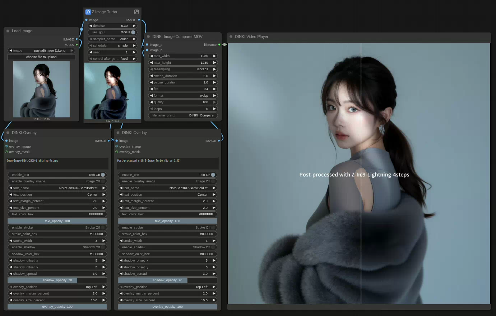

[Home](../README.md) · [All nodes](Node_Catalog.md)
- [Comparison Video Tools](DINKI_Video_Tools.md)
- [Image](DINKI_Image.md)
- [Color Nodes](DINKI_Color_Nodes.md)
- [LM Studio Assistant](DINKI_LM_Studio_Assistant.md)
- [Prompts and Strings](DINKI_Prompt_and_String.md)
- [Node Utilities](DINKI_Node_Utils.md)
- [Internal Processing](DINKI_PS.md)

## 🎬 DINKI Video Tools
  
  
[Download Image_Comparison_Video_with_Overlays.json](../sample_workflows/Image_Comparison_Video_with_Overlays.json)

A comprehensive node suite designed to create **Before/After sliding comparison animations** and **play them directly** within your ComfyUI workflow.

#### ✨ Key Features

* **Dynamic Comparison Generator:**
    * **Sliding Animation:** Creates a professional "scanner-style" sweep animation between two images (Base vs. Target).
    * **Resizing:** Uses `image_a` for output dimensions, downscaling it only when a nonzero size limit is exceeded. `image_b` is resized to those same dimensions; different aspect ratios may be stretched.
    * **Multi-Format Support:** Exports to high-quality **MP4** for video editing or **GIF / Animated WebP** for web sharing.
* **Integrated Video Player:**
    * **On-Graph Playback:** Instantly plays the generated result inside the node graph without opening external players.
    * **Canvas Sync:** The player overlay automatically tracks the node's position and zoom level in real-time.
    * **Format Auto-Detection:** Uses video tags for MP4/WEBM/MOV and image tags for GIF/WebP/PNG/JPG.
* **Animation Controls:**
    * **Timing Precision:** Fully customizable `sweep_duration` (movement speed) and `pause_duration` (hold time at start/end).
    * **Looping:** Set specific loop counts or infinite looping (for GIF/WebP).

#### 💡 Usage Tip: Smart Resolution
To maintain the **original quality and resolution** of your input images:
1.  Set both `max_width` and `max_height` to **0**.
2.  The node will use the exact dimensions of `image_a` as the source resolution.
3.  The images will only be resized if you explicitly set a pixel limit (e.g., 1920) to reduce file size.

#### 🎛️ Input Parameters (DKST Video (Image Compare))

| Parameter | Description |
| :--- | :--- |
| **image_a / image_b** | Connect the two images you want to compare (Before & After). |
| **max_width / max_height** | Limit each output dimension. Set both to **0** to keep the source resolution, apart from even-dimension adjustment for encoding. |
| **resampling** | Choose `lanczos`, `bilinear`, `bicubic`, or `nearest` when resizing. |
| **sweep_duration** | Time (in seconds) for the divider line to travel across the image. |
| **pause_duration** | Time (in seconds) the animation holds still at the start and end. |
| **fps** | Frames per second. Higher values result in smoother motion. |
| **format** | Choose output format: `mp4`, `gif`, or `webp`. |
| **quality** | Compression quality (1-100). |
| **loops** | Number of loops for GIF/WebP (0 = Infinite). |
| **preview_mode** | Write to ComfyUI's temporary folder instead of the output folder. |
| **filename_prefix** | Prefix for the saved filename. |

#### 📺 Input Parameters (DKST Viewer (Video Player))

| Parameter | Description |
| :--- | :--- |
| **filename** | Connect the output `filename` string from the **Image Comparer** node here. |

The player accepts a saved path from either video generator. It detects whether the file came from ComfyUI's temporary or output folder and renders the supported video or image format in the node.

## DKST Video (Depth Parallax)

Combines one `image` and one `depth_map` into a depth-based animation or side-by-side stereo image. The first frame of each input batch is used; a differently sized depth map is resized to the image. `mode` supports `horizontal`, `vertical`, `circle`, `figure8`, `sbs_parallel`, and `sbs_cross`. Set motion `amount`, `phase`, `focus_depth`, `normalize_depth`, and `frames`, then select `fps`, `format`, and `quality`. Formats are `webp`, `gif`, `mp4`, `png`, and `jpg`; still formats save one frame. `preview_mode` writes to ComfyUI's temporary folder, while the default writes to output. `filename_prefix` names the result. The `filename` output is the saved path and can feed Video Player.
