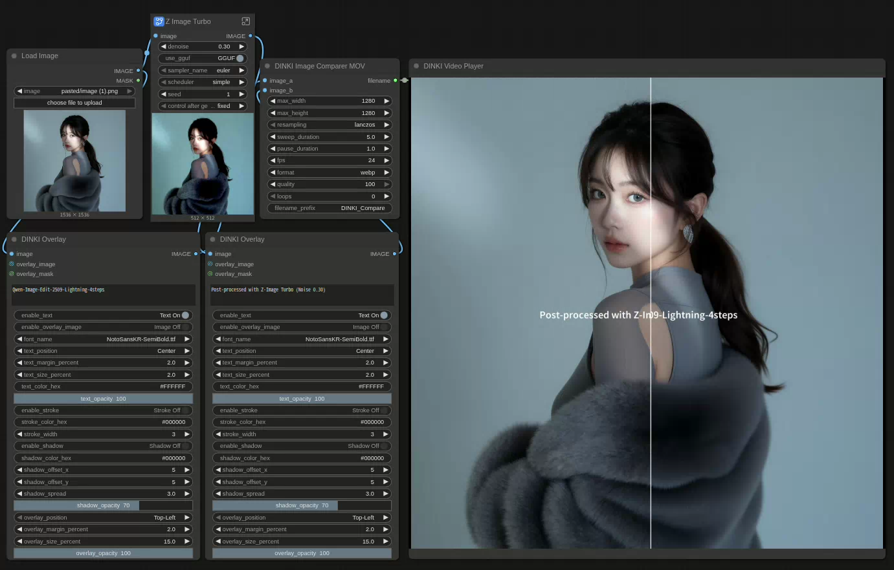

[Home](../README.md) · [All nodes](Node_Catalog.md)
- [Comparison Video Tools](DINKI_Video_Tools.md)
- [Image](DINKI_Image.md)
- [Color Nodes](DINKI_Color_Nodes.md)
- [LM Studio Assistant](DINKI_LM_Studio_Assistant.md)
- [Prompts and Strings](DINKI_Prompt_and_String.md)
- [Node Utilities](DINKI_Node_Utils.md)
- [Internal Processing](DINKI_PS.md)

## 🎬 DINKI Video Tools
  
  
[Download Image_Comparison_Video_with_Overlays.json](../sample_workflows/Image_Comparison_Video_with_Overlays.json)

A comprehensive node suite designed to create **Before/After sliding comparison animations** and **play them directly** within your ComfyUI workflow.

#### ✨ Key Features

* **Dynamic Comparison Generator:**
    * **Sliding Animation:** Creates a professional "scanner-style" sweep animation between two images (Base vs. Target).
    * **Resizing:** Uses `image_a` for output dimensions, downscaling it only when a nonzero size limit is exceeded. `image_b` is resized to those same dimensions; different aspect ratios may be stretched.
    * **Channel Matching:** Grayscale inputs become RGB, and RGBA inputs are composited over black. RGB and RGBA images can be compared together without a separate conversion node.
    * **Multi-Format Support:** Exports to high-quality **MP4** for video editing or **GIF / Animated WebP** for web sharing.
* **Integrated Video Player:**
    * **On-Graph Playback:** Plays the generated result inside a resizable node widget without opening an external player.
    * **Nodes 2.0 Layout:** The player stays inside the node when it is first created, moved, zoomed, or resized.
    * **Format Auto-Detection:** Uses video tags for MP4/WEBM/MOV and image tags for GIF/WebP/PNG/JPG.
* **Animation Controls:**
    * **Timing Precision:** Fully customizable `sweep_duration` (movement speed) and `pause_duration` (hold time at start/end).
    * **Looping:** Set specific loop counts or infinite looping (for GIF/WebP).

#### 💡 Usage Tip: Smart Resolution
To maintain the **original quality and resolution** of your input images:
1.  Set both `max_width` and `max_height` to **0**.
2.  The node will use the exact dimensions of `image_a` as the source resolution.
3.  The images will only be resized if you explicitly set a pixel limit (e.g., 1920) to reduce file size.

#### 🎛️ Input Parameters (DKST Video (Image Compare))

| Parameter | Description |
| :--- | :--- |
| **image_a / image_b** | Connect the two images you want to compare (Before & After). |
| **max_width / max_height** | Limit each output dimension. Set both to **0** to keep the source resolution, apart from even-dimension adjustment for encoding. |
| **resampling** | Choose `lanczos`, `bilinear`, `bicubic`, or `nearest` when resizing. |
| **sweep_duration** | Time (in seconds) for the divider line to travel across the image. |
| **pause_duration** | Time (in seconds) the animation holds still at the start and end. |
| **fps** | Frames per second. Higher values result in smoother motion. |
| **format** | Choose output format: `mp4`, `gif`, or `webp`. |
| **quality** | Compression quality (1-100). |
| **loops** | Number of loops for GIF/WebP (0 = Infinite). |
| **preview_mode** | Write to ComfyUI's temporary folder instead of the output folder. |
| **filename_prefix** | Prefix for the saved filename. |

The generated MP4 plays inside DKST Video (Image Compare); GIF and WebP results are displayed there too. Right-click the preview for a two-item menu: `Open Video` and `Save Video`. The actions use the latest generated file, including files created in preview mode.

#### 📺 Input Parameters (DKST Video (Sequence Player))

| Parameter | Description |
| :--- | :--- |
| **filename** | Connect the output `filename` string from the **Image Comparer** node here. |

The player accepts a saved path from either video generator. It detects whether the file came from ComfyUI's temporary or output folder and renders the supported video or image format in the node.
Right-click the player for `Open Video` or `Save Video`. Both actions use the current file, including GIF or WebP output from the video generators.

#### DKST Video (Video Player)

Connect a native ComfyUI `VIDEO` input. This output node also passes the same `VIDEO` value onward, so it can be selected with **Execute to selected output nodes**. `filename_prefix` defaults to `DKST_Video`. `format` offers `auto`, `mp4`, `mkv`, and `webm`; `codec` offers `auto`, `h264`, and `av1`. Auto format produces WebM with AV1 and MP4 otherwise. WebM cannot be paired with H.264. `always_save` is off by default, writing to ComfyUI's temporary folder; turning it on writes to the output folder.

The on-node player shows video resolution and keeps the node at the user's chosen size. **Fit** contains the full frame while preserving its aspect ratio. **100%** shows one video pixel per screen pixel inside a scrollable viewport. Right-click for `Open Video` or `Save Video`, which use the saved file in the selected format. For formats browsers may not play directly, the node creates a temporary H.264 MP4 solely for playback.

## DKST Video (Depth Parallax)

Combines one `image` and one `depth_map` into a depth-based animation or side-by-side stereo image. The first frame of each input batch is used; a differently sized depth map is resized to the image. `mode` supports `horizontal`, `vertical`, `circle`, `figure8`, `sbs_parallel`, and `sbs_cross`. Set motion `amount`, `phase`, `focus_depth`, `normalize_depth`, and `frames`, then select `fps`, `format`, and `quality`. Formats are `webp`, `gif`, `mp4`, `png`, and `jpg`; still formats save one frame. `preview_mode` writes to ComfyUI's temporary folder, while the default writes to output. `filename_prefix` names the result. The `filename` output is the saved path and can feed Video Player.

## DKST Video (Load & Crop)

Loads videos from ComfyUI's `input` directory and its subfolders. Put a video in
`input` or a subfolder, select `category` and `filename`, then edit directly in the
node. You can also click **Upload Video**, or drop a video onto the node or its
preview. Uploads are saved in the selected category (`input` itself for the root
category), then selected and previewed automatically. Existing files are not
overwritten; if the server assigns a new filename, that filename is selected.
Uploading a video resets crop and trim for the new source while preserving your
resolution and FPS mode settings. **Refresh files** updates the lists after adding files. Supported extensions
are MP4, MOV, WebM, MKV, AVI, M4V, MPG, MPEG, and TS; decoding depends on PyAV's codec
support. This node requires a ComfyUI installation with native `VIDEO` support and
PyAV. It does not install packages automatically.

[Download Video_Load_Crop.json](../sample_workflows/Video_Load_Crop.json)

### Crop and resize

The preview uses the same draggable rectangle and aspect-ratio controls as
**DKST Image (Load & Crop)**. Drag inside the rectangle to move it, or drag a corner
to resize it. Choose `Original`, a ratio preset, or `Custom` with width/height ratio
fields. The same spatial crop applies to every output frame. Rotation metadata is
applied before cropping.

`megapixels` controls the cropped output's target pixel area, using the existing
DKST convention **1 MP = 1024 × 1024 pixels**. `resolution_multiple` rounds both
output dimensions to a multiple from 4 to 128, in steps of 4. The preview displays
source-crop and output dimensions. Rounding can slightly change the aspect ratio.

### Trim and playback

- Drag the **IN** and **OUT** handles at the ends of the highlighted timeline range.
- Click or drag elsewhere on the timeline to seek through the source video.
- Enter **IN** and **OUT** directly in seconds, or enter **Length** to set
  `OUT = IN + Length`. The result is clamped to the source's end.
- Arrow keys on a focused trim handle move it by one source-frame interval;
  Shift + arrow moves it by one second.
- **Play** loops the selected range. **Full range** restores the complete source.
- Editing previews are silent. Original audio, when present, is trimmed with the
  video and retained in the `video` output.

IN is inclusive and OUT is exclusive. The serialized/backend `trim_out = 0`
means the source's end; the visible OUT field displays the actual end time.
Changing a file resets its crop and trim. Refreshing files or reloading the
workflow preserves the saved settings and user-selected node dimensions.

Browsers that cannot decode the source use a temporary H.264 preview, capped at
720 pixels on its longest side and 24 FPS. Creating this preview can take time for
long videos. It is cached by the source file's modification time and size. All
output processing uses the original source, regardless of preview quality.

### FPS and outputs

`fps_mode = Original` preserves the detected source rate, including fractional
rates such as 30000/1001. Choose `Custom` and enter `output_fps` (0.01–240) to change
the output rate. **Original FPS** restores Original mode and the source value.
Changing FPS preserves playback speed: frames are selected or repeated according
to their presentation timestamps. This also handles variable-frame-rate sources;
Original mode emits a constant-rate batch at the detected average/nominal rate.
There is no motion interpolation.

| Output | Type | Meaning |
| :--- | :--- | :--- |
| `video` | `VIDEO` | Cropped, resized, trimmed video with synchronized audio when available. Connect to DKST Video (Video Player) or ComfyUI Save Video. |
| `images` | `IMAGE` | The same processed RGB frames as a batch. |
| `fps` | `FLOAT` | Actual output frame rate. |
| `frame_count` | `INT` | Actual output batch size. |
| `duration` | `FLOAT` | Actual output duration, `frame_count / fps`. |

The output uses `ceil(selected_length × fps)` frames, apart from floating-point
roundoff. Its duration can therefore exceed the requested interval by less than
one output-frame period; the last frame is held and the remaining audio tail is
silence. Output FPS changes do not time-stretch audio.

Processing seeks near IN and decodes frames incrementally, cropping/resizing
before storing them. The final `IMAGE` batch still lives in memory: the node shows
an approximate frame count and memory size before execution. Reducing Length,
megapixels, or FPS reduces that allocation. Outputs are 8-bit-decoded RGB converted
to float tensors; HDR color management and transparent-video alpha are not
implemented.
