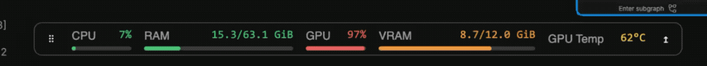

# DKST System Monitor

Displays **CPU**, **RAM**, **GPU**, **VRAM**, and **GPU Temp**, in that default order, in a floating monitor that can be docked in the ComfyUI top toolbar. New users start with RAM/VRAM percentages enabled. Existing saved preferences are preserved. These are whole-server measurements, not browser-computer or ComfyUI-process-only usage. No workflow node is needed.

Designed for Windows with NVIDIA drivers. GPU telemetry uses the driver's `nvidia-smi`; CPU and RAM use `psutil`, normally installed with ComfyUI. Missing dependencies or unsupported sensors display `—` rather than interrupting workflows. Hover over the monitor for GPU names and diagnostic messages.

Restart ComfyUI and refresh the browser after installing the update. In **Settings → DKST → Monitor**:

- **Show system monitor**: enable/disable the toolbar display and polling (default: on).
- **Monitor placement**: `Toolbar` docks in the top toolbar; `Floating` (default) allows free positioning. Drag the dotted handle to detach and move the monitor. Use the arrow button to dock/undock. Floating position is saved and kept within the viewport when the window is resized.
- **Show RAM as percentage / Show VRAM as percentage**: independently choose occupancy percentage instead of used/total GiB (both default to on). CPU/GPU utilization is always a percentage; temperature remains in °C because no universal temperature percentage is defined.
- **Show usage bars**: display a slim horizontal bar beneath CPU, RAM, GPU and VRAM (default: off). The filled portion uses the theme accent color; the remainder is a light track. RAM/VRAM bars still show occupancy when their text is set to GiB.
- **Color by usage**: color the bars and numeric values by their 0–100 level (default: off): green below 50, yellow from 50, orange from 70, and red from 85. GPU temperature text uses its Celsius value on the same scale; temperature has no usage bar. Missing readings retain the normal text color and an empty bar.
- **Refresh interval (seconds)**: 1–30 seconds (default: 2). The next request starts after the previous one completes.
- **NVIDIA GPU index**: physical index reported by `nvidia-smi` (default: 0). It is not the remapped CUDA device index; hover over the monitor to see available devices.
- **Monitor items**: drag the dotted handle beside CPU, GPU, GPU Temp, RAM or VRAM up/down to reorder the list. Check/uncheck an item to show/hide it. Focus a handle and use the up/down arrow keys for keyboard reordering. Changes apply immediately and persist through ComfyUI settings. Hiding every metric removes the monitor and stops polling. Existing numeric order and visibility preferences are retained until the list is edited.

Memory values are used/total **GiB**. GPU utilization is the GPU engine utilization, not VRAM occupancy. RAM usage is total minus available memory. Unsupported individual GPU sensors remain `—` even if other GPU values are available.

Queries run outside the HTTP event loop with a three-second NVIDIA timeout, no Windows console window, and a one-second shared server cache. Hidden browser tabs and disabled monitors stop polling. Failed requests clear old values and retry automatically. Narrow toolbars allow horizontal scrolling within the monitor.

If all GPU fields show `—`, run `nvidia-smi` in a terminal on the ComfyUI server and check the NVIDIA driver. If CPU/RAM are unavailable, install `psutil` using the same Python environment that runs ComfyUI.

Implementation references: [NVIDIA query documentation](https://docs.nvidia.com/deploy/nvidia-smi/) and [ComfyUI settings API](https://docs.comfy.org/custom-nodes/js/javascript_settings).

Validation covers mocked Windows/NVIDIA responses, failures, multi-GPU selection, polling lifecycle and formatting. Actual Windows/NVIDIA hardware validation is still required.
